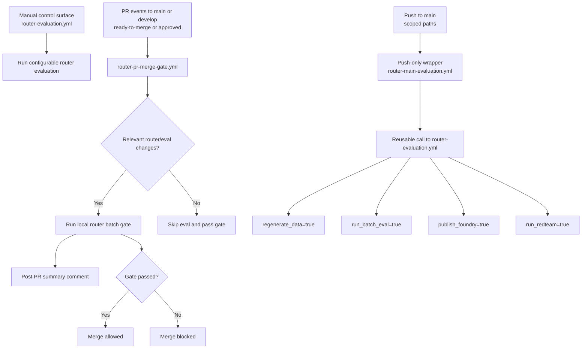

# GitHub Workflows Guide

This folder contains the CI and router-governance workflows for the repository.
It uses the same operating terms as the root README: manual control surface, push-only wrapper, and low-credit profiles.

## Workflow Map

| Workflow               | File                                                     | Trigger                             | Primary Purpose                                                         |
| ---------------------- | -------------------------------------------------------- | ----------------------------------- | ----------------------------------------------------------------------- |
| CI                     | [ci.yml](ci.yml)                                         | Push/PR (scoped paths)              | Lint, typecheck, tests, coverage, Sonar scan                            |
| Router Evaluation      | [router-evaluation.yml](router-evaluation.yml)           | Manual dispatch + reusable call     | Core router evaluation pipeline and outputs                             |
| Router Main Evaluation | [router-main-evaluation.yml](router-main-evaluation.yml) | Push to main (scoped paths)         | Main-branch wrapper that calls Router Evaluation with full cloud checks |
| Router PR Merge Gate   | [router-pr-merge-gate.yml](router-pr-merge-gate.yml)     | PR events (ready-to-merge/approved) | Pre-merge local router gate, PR comment summary, merge block on failure |

## Execution Flow

## Which Workflow Should I Run Manually?

Use [router-evaluation.yml](router-evaluation.yml) for all manual runs.

- It is the single manual control surface in this folder, with configurable inputs for router validation.
- [router-main-evaluation.yml](router-main-evaluation.yml) is intentionally push-only; it is an orchestration wrapper.
- [router-pr-merge-gate.yml](router-pr-merge-gate.yml) is event-driven for PR governance and not a day-to-day manual runner.

## Router Evaluation Inputs

The most important configuration surface is [router-evaluation.yml](router-evaluation.yml).

### Manual inputs (workflow_dispatch)

| Input                 | Type    | Default     | Effect                                                                                                                                                                  |
| --------------------- | ------- | ----------- | ----------------------------------------------------------------------------------------------------------------------------------------------------------------------- |
| ref                   | string  | empty       | Branch, tag, or SHA to evaluate. Empty means current SHA.                                                                                                               |
| regenerate_data       | boolean | false       | Regenerates eval_router_data.jsonl via MCP server before scoring.                                                                                                       |
| run_batch_eval        | boolean | true        | Runs batch evaluators. Token-consuming only when publish_foundry is true and Foundry auth succeeds; otherwise scores locally (`--local`) with zero Azure/network calls. |
| publish_foundry       | boolean | false       | Publishes batch evaluation run to Azure AI Foundry.                                                                                                                     |
| run_redteam           | boolean | false       | Runs red-team safety scan.                                                                                                                                              |
| fail_on_redteam_error | boolean | false       | Fails workflow if red-team step fails.                                                                                                                                  |
| redteam_flow          | string  | cloud-model | Selects red-team execution flow.                                                                                                                                        |
| min_route_accuracy    | string  | 0.95        | Pass/fail threshold for route gate.                                                                                                                                     |

### Reusable inputs (workflow_call)

The same logical inputs are available when this workflow is called by another workflow, but note one default difference:

- regenerate_data defaults to true in workflow_call.

This enables wrapper workflows to regenerate route data by default while keeping manual runs cheaper by default.

## Router Evaluation Runtime Stages

1. Checkout selected ref.
2. Install Python and dependencies (and optional red-team group).
3. Optional route data regeneration.
4. Compute route gate from src/maf_graphrag/evaluation/datasets/eval_router_data.jsonl.
5. Enforce min_route_accuracy.
6. Run batch evaluation (local only or Foundry publish path).
7. Optional red-team run + optional fail policy.
8. Upload artifacts and write summary.

### Artifacts

The workflow uploads router-evaluation-results with:

- src/maf_graphrag/evaluation/datasets/eval_router_data.jsonl
- src/maf_graphrag/evaluation/results/evaluation_results.json
- src/maf_graphrag/evaluation/results/evaluation_report.md
- src/maf_graphrag/evaluation/results/redteam_results.json (when produced)
- mcp-server.log (when produced)

### Auth fallback behavior

If publish_foundry or run_redteam is requested but service principal secrets are missing, the workflow:

- emits a warning,
- skips Foundry-dependent paths,
- and can still run local batch evaluation.

"Local batch evaluation" means `run_batch_evaluation.py --local`: Agent Framework's native
`LocalEvaluator` (`tool_calls_present`, `tool_call_args_match`) scores the already-generated
`eval_router_data.jsonl` with zero Azure OpenAI/Foundry calls. Signal is limited to tool-call
correctness; run with `publish_foundry=true` for quality/safety LLM-judge signal.

## Router PR Merge Gate Behavior

[router-pr-merge-gate.yml](router-pr-merge-gate.yml) has four jobs:

1. Change detection against PR base/head.
2. Local pre-merge router evaluation (no Foundry publish, no red-team).
3. PR comment upsert with route metrics and run URL.
4. Merge gate decision (fails when evaluation is required and not successful).

### When it activates

The gate runs when one of these is true:

- PR to main or develop has label ready-to-merge.
- A PR review is submitted as approved on a PR targeting main or develop.

### What can skip evaluation

Change detection is deny-list based, not allow-list based: it skips the gate only when every
changed file is provably doc/metadata-only (`*.md`, `docs/`, `LICENSE`, `.gitignore`,
`.gitattributes`). Any other change (code, MCP tool schemas, prompts, `settings.yaml`,
dependency files, workflow YAML, article assets, etc.) runs the gate. This is intentional —
an allow-list of "known relevant" paths silently stops protecting new code as the repo grows;
a deny-list only needs updating when a new _safe-to-skip_ path type appears. Both
[router-pr-merge-gate.yml](router-pr-merge-gate.yml) and
[router-main-evaluation.yml](router-main-evaluation.yml) use the identical deny-list.

## Router Main Evaluation Behavior

[router-main-evaluation.yml](router-main-evaluation.yml) is the main-branch cloud validation wrapper.

- Trigger: push to main with router/evaluation-sensitive file changes (`**.py`, `prompts/**`,
  `settings.yaml`, `pyproject.toml`, `uv.lock`, and the workflow files themselves at the GitHub
  Actions path-filter level; the in-job change-detection step then applies the same deny-list
  logic as the PR merge gate — see [What can skip evaluation](#what-can-skip-evaluation)).
  Intentionally scoped to `main` only
  (not `develop`) so the full-cloud profile (Foundry publish + red-team) stays reserved for the branch that
  actually ships; `develop` gets CI and the local PR merge gate only.
- Executes change detection first.
- Calls [router-evaluation.yml](router-evaluation.yml) with:
  - regenerate_data=true
  - run_batch_eval=true
  - publish_foundry=true
  - run_redteam=true
  - min_route_accuracy=0.95

Use this as the automatic post-merge guardrail, not as the primary manual control surface.

## Low-Credit Profiles

Use [router-evaluation.yml](router-evaluation.yml) with one of these presets.

### Cheap safety check

- regenerate_data=false
- run_batch_eval=true
- publish_foundry=false
- run_redteam=false

Scores the existing `eval_router_data.jsonl` with the local, zero-cost `LocalEvaluator` path —
no MCP server, no Azure OpenAI/Foundry calls at all.

### Data refresh plus local eval

- regenerate_data=true
- run_batch_eval=true
- publish_foundry=false
- run_redteam=false

Regenerates `eval_router_data.jsonl` against a live MCP server + router run (Azure OpenAI
tokens for the router/search calls), then scores it locally with zero additional Foundry cost.

### Full cloud validation

- regenerate_data=true
- run_batch_eval=true
- publish_foundry=true
- run_redteam=true

## Related Docs

- Root overview: [../../README.md](../../README.md)
- Router workflow architecture: [../../src/maf_graphrag/workflows/README.md](../../src/maf_graphrag/workflows/README.md)
- Evaluation scripts and troubleshooting: [../../src/maf_graphrag/evaluation/README.md](../../src/maf_graphrag/evaluation/README.md)
- Azure auth checklist for Foundry/red-team: [../../docs/evaluation-azure-auth-checklist.md](../../docs/evaluation-azure-auth-checklist.md)
