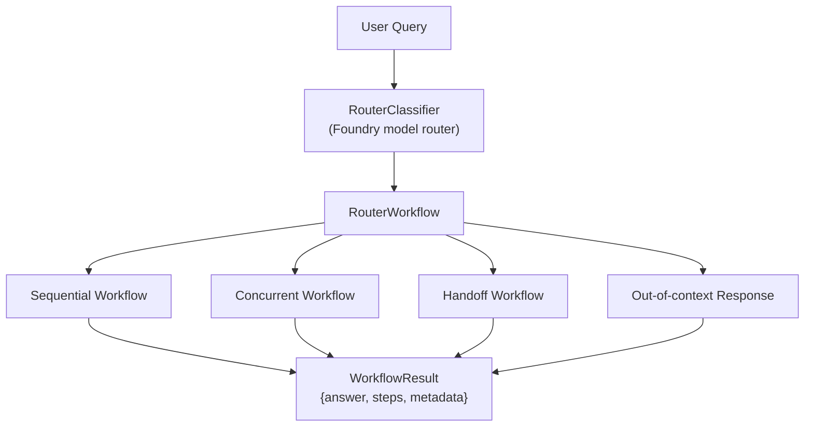
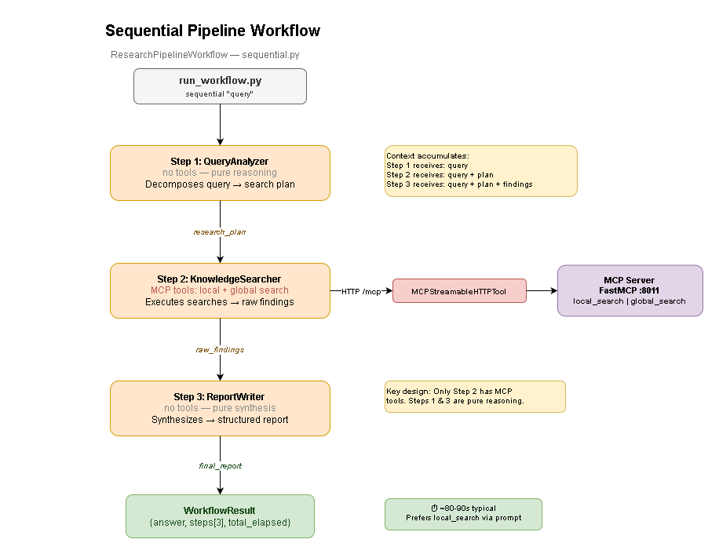
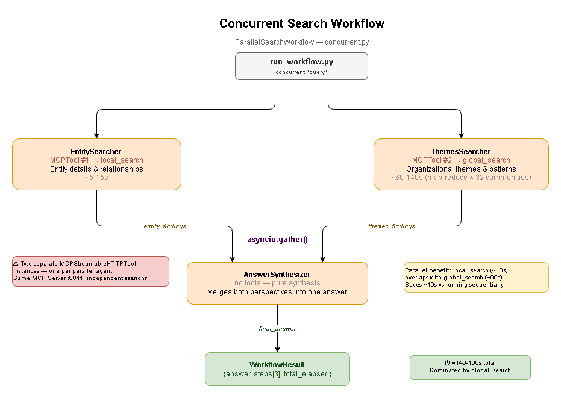
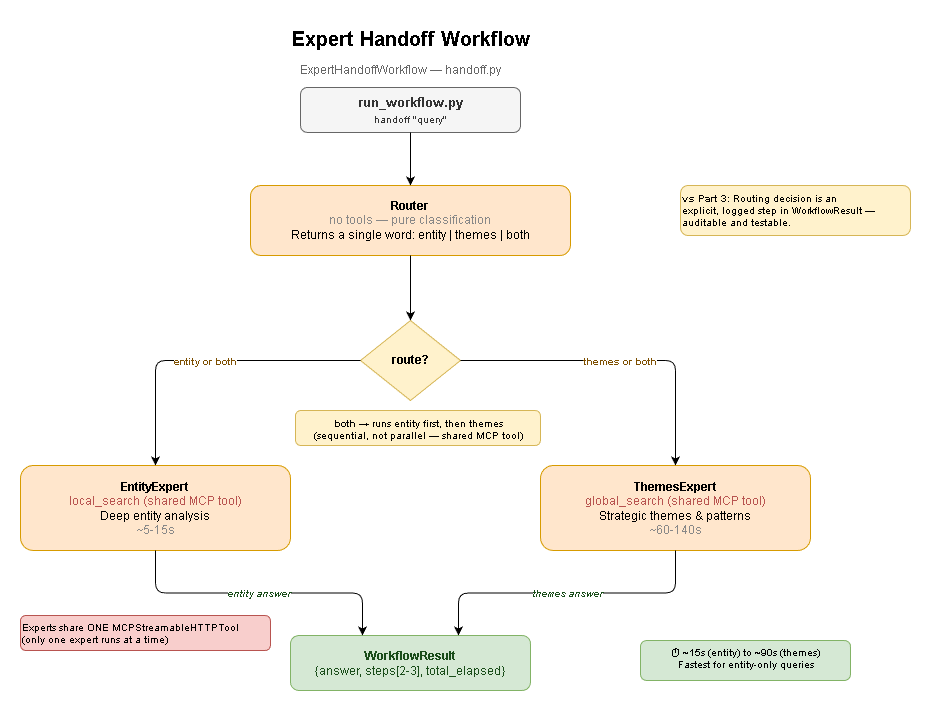
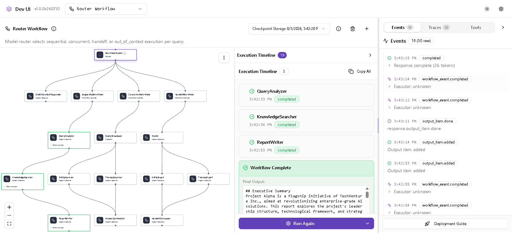
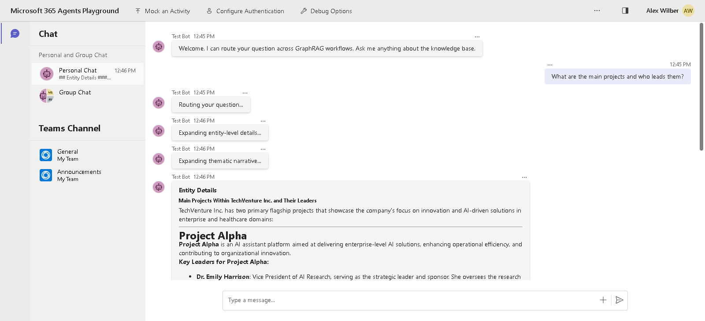

# MAF + GraphRAG Series

Building knowledge-graph assistants with Microsoft GraphRAG, Agent Framework, and Azure OpenAI.

[](https://sonarcloud.io/summary/new_code?id=cristofima_maf-graphrag-series)
[](https://sonarcloud.io/summary/new_code?id=cristofima_maf-graphrag-series)
[](https://sonarcloud.io/summary/new_code?id=cristofima_maf-graphrag-series)
[](https://sonarcloud.io/summary/new_code?id=cristofima_maf-graphrag-series)
[](https://sonarcloud.io/summary/new_code?id=cristofima_maf-graphrag-series)
[](https://sonarcloud.io/summary/new_code?id=cristofima_maf-graphrag-series)
[](https://sonarcloud.io/summary/new_code?id=cristofima_maf-graphrag-series)

## Core Stack

| Technology      | Version Family | Purpose                                  |
| --------------- | -------------- | ---------------------------------------- |
| GraphRAG        | `3.0.x`        | Knowledge graph indexing and retrieval   |
| Agent Framework | `1.15.x`       | Agents, orchestration, and model clients |
| FastMCP         | `3.4.x`        | MCP server hosting over Streamable HTTP  |

## Series Overview

| Part | Title                            | Status      | Module                                             |
| ---- | -------------------------------- | ----------- | -------------------------------------------------- |
| 1    | GraphRAG Fundamentals            | ✅ Complete | `src/core/`                                        |
| 2    | GraphRAG MCP Server              | ✅ Complete | `src/mcp_server/`                                  |
| 3    | Agent Framework Patterns         | ✅ Complete | `src/agents/`                                      |
| 4    | Workflow Patterns                | ✅ Complete | `src/workflows/`                                   |
| 5    | Agent Evaluation                 | ✅ Complete | `src/evaluation/`                                  |
| 6    | Router SLM Integration           | ✅ Complete | `src/agents/`, `src/workflows/`, `src/evaluation/` |
| 7    | Conversational Session Readiness | ✅ Complete | `src/agents/`, `src/workflows/`                    |
| 8    | Human-in-the-Loop                | ⏳ Planned  | —                                                  |
| 9    | Tool Registry                    | ⏳ Planned  | —                                                  |
| 10   | Production Deployment            | ⏳ Planned  | —                                                  |

## Current Architecture

All user traffic enters through `RouterWorkflow`, which classifies each query and delegates to the appropriate specialist pattern. The router is the single production entry point for both the DevUI and connector surfaces.


```mermaid
flowchart TD
    Q["User Query"]
    Q --> RC["RouterClassifier\n(Foundry model router)"]
    RC --> RW["RouterWorkflow"]
    RW --> SQ["Sequential Workflow"]
    RW --> CC["Concurrent Workflow"]
    RW --> HF["Handoff Workflow"]
    RW --> OOC["Out-of-context Response"]
    SQ & CC & HF & OOC --> OUT["WorkflowResult\n{answer, steps, metadata}"]
```

| Surface             | Entry Point                           | Purpose                                        |
| ------------------- | ------------------------------------- | ---------------------------------------------- |
| DevUI               | `uv run python run_devui.py`          | Workflow graph visualization and event tracing |
| Teams/Connector API | `uv run python run_router_chatbot.py` | `/api/messages` endpoint for Agents Playground |

## Quick Start

```powershell
# Install dependencies
uv sync --dev

# Configure Azure credentials
cp .env.example .env
# Edit .env with your Azure OpenAI values

# Build the knowledge graph from documents in input/documents/
uv run python -m core.index

# Terminal 1: MCP server (tool backend)
uv run python run_mcp_server.py

# Terminal 2: Router workflow (DevUI)
uv run python run_devui.py

# Terminal 3 (optional): Connector endpoint for Agents Playground
uv run python run_router_chatbot.py
```

📖 See [docs/uv-guide.md](docs/uv-guide.md) for environment setup details.

---

## Part 1 — GraphRAG Fundamentals

Build and query a knowledge graph from documents. Introduces entity extraction, relationship detection, community detection, and local vs. global search strategies.

```powershell
uv run python -m core.index
uv run python -m core.example "Who leads Project Alpha?"
uv run python -m core.example "What are the main themes?" --type global
```

```python
from core import load_all, local_search, global_search

data = load_all()
response, _ = asyncio.run(local_search("Who leads Project Alpha?", data))
```

After indexing the 10 sample documents the knowledge graph contains 147 entities, 263 relationships, 32 communities, and 20 text units.

📖 See [src/core/README.md](src/core/README.md) for the full API reference.

---

## Part 2 — GraphRAG MCP Server

Expose GraphRAG as an MCP server so agents and tools can query the knowledge graph via a standard protocol.

```powershell
uv run python run_mcp_server.py
npx @modelcontextprotocol/inspector   # browser UI at http://localhost:6274
```

| Tool                     | Purpose               |
| ------------------------ | --------------------- |
| `search_knowledge_graph` | Main entry point      |
| `local_search`           | Entity-focused search |
| `global_search`          | Thematic search       |
| `list_entities`          | Browse entities       |
| `get_entity`             | Entity details        |

📖 See [src/mcp_server/README.md](src/mcp_server/README.md) for server documentation.

---

## Part 3 — Agent Framework Patterns

Introduced Agent Framework concepts that underpin all subsequent parts: MCP tool connectivity (`create_mcp_tool`), Foundry chat client factory (`create_client`), observability middleware pipeline, and the research delegate sub-agent pattern (`create_research_delegate`) for context-isolated deep searches.

The Knowledge Captain conversational agent introduced in this part was superseded by the router-first workflow architecture in Part 6 and removed in Part 7.

| Pattern                                 | Where used today                                        |
| --------------------------------------- | ------------------------------------------------------- |
| `create_mcp_tool`                       | All workflow classes connect to the MCP server via this |
| `create_client` / `create_azure_client` | Workflow agents and the router classifier               |
| Middleware pipeline                     | Available for optional agent instrumentation            |
| `create_research_delegate`              | Context-isolated sub-agent for deep graph searches      |

📖 See [src/agents/README.md](src/agents/README.md) for the API reference.

---

## Part 4 — Workflow Patterns

Multi-agent workflow patterns that the router selects between. All patterns connect to the same MCP server and return `WorkflowResult` for full step traceability.

| Pattern    | Agents / Steps                                | Best For                     |
| ---------- | --------------------------------------------- | ---------------------------- |
| Router     | RouterClassifier → delegated workflow         | **Production entry point**   |
| Sequential | QueryAnalyzer → KnowledgeSearcher → Writer    | Complex multi-step research  |
| Concurrent | EntitySearcher ∥ ThemesSearcher → Synthesizer | Dual-perspective questions   |
| Handoff    | Router → EntityExpert \| ThemesExpert         | Auditable specialist routing |







```python
from workflows import ResearchPipelineWorkflow, ParallelSearchWorkflow, ExpertHandoffWorkflow

async with ResearchPipelineWorkflow() as wf:
    result = await wf.run("What is the technology strategy for Project Alpha?")
    print(result.answer)
    print(result.step_summary())
```

📖 See [src/workflows/README.md](src/workflows/README.md) for workflow configuration and prompt references.

---

## Part 5 — Agent Evaluation

End-to-end evaluation pipeline: LLM-as-judge quality metrics, custom graph-based evaluators, OpenTelemetry tracing, and optional red team safety scanning.

| Step | Script                    | What it does                                           |
| ---- | ------------------------- | ------------------------------------------------------ |
| 1    | `run_mcp_server.py`       | Start the MCP server                                   |
| 2    | `generate_eval_data.py`   | Run router on golden questions → `eval_data.jsonl`     |
| 3    | `run_batch_evaluation.py` | Built-in + custom evaluators, write results and report |
| 4    | `run_redteam.py`          | Safety scan (optional, requires Azure AI Foundry)      |

| Evaluator                       | Type          | What it measures                                      |
| ------------------------------- | ------------- | ----------------------------------------------------- |
| `TaskAdherenceEvaluator`        | LLM-judge     | Does the response complete the task?                  |
| `IntentResolutionEvaluator`     | LLM-judge     | Does the response address user intent?                |
| `RelevanceEvaluator`            | LLM-judge     | Is the response relevant to the query?                |
| `CoherenceEvaluator`            | LLM-judge     | Is the response logically consistent?                 |
| `ResponseCompletenessEvaluator` | LLM-judge     | Does the response cover expected content?             |
| `EntityAccuracyEvaluator`       | Graph Parquet | Are entities in the response valid graph entities?    |
| `RelationshipValidityEvaluator` | Graph Parquet | Do co-occurrences reflect actual graph relationships? |

Telemetry tip: call `setup_monitoring(config)` from `evaluation.monitoring.otel_setup` before running evaluations so spans reach either an OTLP collector or Application Insights. Set `ENABLE_SENSITIVE_DATA=1` only when you need raw prompts and responses in telemetry; keep it disabled in shared environments.

📖 See [src/evaluation/README.md](src/evaluation/README.md) for the complete reference.

---

## Part 6 — Router SLM Integration

Moved from workflow demos to a production router posture. All user traffic is classified by a Foundry model router and routed to the best-fit pattern. Introduces the connector-style chatbot endpoint for Microsoft 365 Agents Playground.

### Routing Contract

| Rule                          | Behavior                                      |
| ----------------------------- | --------------------------------------------- |
| Confidence threshold          | Route as classified when confidence ≥ 80      |
| Transient classifier failures | Retry up to 3×, then continue if recovered    |
| Exhausted classifier failures | Fallback to sequential with explicit metadata |
| Unknown workflow label        | Fallback to sequential                        |
| `out_of_context` label        | Return direct guidance — no retrieval fan-out |

Required metadata fields on every `WorkflowResult.steps[0]`:

```
classified_workflow · routed_workflow · classifier_status · classifier_attempts · fallback_reason
```

### Screenshots

**DevUI — Router Workflow**



**Microsoft 365 Agents Playground**



### Microsoft 365 Agents Playground

```powershell
# Install (choose one)
winget install agentsplayground
npm install -g @microsoft/m365agentsplayground

# Run against the local router endpoint
agentsplayground -e http://localhost:3978/api/messages -c msteams
```

📖 See [.github/workflows/README.md](.github/workflows/README.md) for router evaluation inputs, PR gate behavior, and main-branch orchestration.

---

## Part 7 — Conversational Session Readiness

Delivers multi-turn session management on top of the Part 6 router architecture without changing routing policy or the metadata contract.

### Implemented

- `InMemorySessionStore` extending `agent_framework.SessionStore` with TTL expiration, bounded LRU capacity, and opportunistic cleanup.
- Deterministic session identity from channel + conversation + user, with a per-session `asyncio.Lock` to serialize concurrent requests on the same session.
- Session-aware query composition: bounded conversation history prepended to follow-up turns before routing.
- Session and lock diagnostics propagated into router span attributes and structured logs.
- `RouterWorkflowAgentAdapter`: agent-style facade over `RouterWorkflow` with optional `CheckpointStorage` — used by `RouterChatService` for the chatbot connector path.
- Knowledge Captain removed; `RouterWorkflow` is the sole production conversational entry point.
- **Process-local checkpoint/resume**:
  - `ActiveWorkflowRun` dataclass tracking `checkpoint_id`, `workflow_type`, and resume status.
  - `InMemoryCheckpointStorage` threaded to `Workflow.run()` at call time; sub-workflows have fixed `WorkflowBuilder(name=...)` for reliable `get_latest()` queries.
  - After a session timeout, the latest superstep checkpoint is captured and stored in `session_record.active_workflow_run`.
  - On the next request, the checkpoint is validated (stale and incompatible types rejected) and passed as `checkpoint_id` to the workflow for resume.
  - `resumed_from_checkpoint` and `checkpoint_id_used` are observable in structured logs and `channelData.session` in the Playground Activity Viewer.
- Manual session continuity validated against Microsoft 365 Agents Playground — full chat transcripts, diagnostics, and router metadata are documented in [docs/part7-implementation-notes.md](docs/part7-implementation-notes.md). Snapshot of a structured log payload recorded for the second turn:

```json
{
  "event": "router_chatbot.message_processed",
  "session_id": "8a9cf8519191c73decd1ec056adae276",
  "turn_index": 2,
  "memory_hits": 1,
  "lock_wait_ms": 0.005,
  "lock_hold_ms": 22770.348,
  "resumed_from_checkpoint": false,
  "checkpoint_id_used": null
}
```

### Deferred considerations

- Induced-timeout checkpoint resume validation is out of scope for this release due to operational complexity; automated tests cover checkpoint acceptance/rejection paths.

---

## Sample Q&A Results

### Local Search (Entity-Focused)

**Q:** "Who resolved the GraphRAG index corruption incident and what was the root cause?"

> The GraphRAG index corruption incident was resolved through the collaborative efforts of Sophia Lee, Priya Patel, Dr. Emily Harrison, and David Kumar. The root cause was an interrupted indexing job during an Azure Container Apps scaling event. Resolution involved a full re-index with validation checks and atomic swap procedures.

**Q:** "Who leads Project Alpha and what is their background?"

> Dr. Emily Harrison leads Project Alpha. She holds a Ph.D. in Quantum Computing from MIT and has 15 years of experience in advanced computing research. Under her leadership, Project Alpha has achieved 99.7% gate fidelity.

### Global Search (Thematic)

**Q:** "What are the main initiatives at TechVenture?"

> TechVenture Inc. pursues two major strategic initiatives: **Project Alpha** (quantum computing, Phase 4 GA Preparation) led by Dr. Emily Harrison, and **Project Beta** (AI/ML for healthcare, active production) with enterprise customers. Both projects share cross-functional teams spanning Research, Engineering, and Infrastructure.

See [docs/qa-examples.md](docs/qa-examples.md) for more examples.

---

## Azure AI Services

| Service                  | Purpose                    | Tooling                       |
| ------------------------ | -------------------------- | ----------------------------- |
| **Azure OpenAI**         | Entity extraction, queries | GPT-4.1 family + model-router |
| **Azure OpenAI**         | Document embeddings        | text-embedding-3-small        |
| **Agent Framework**      | Multi-agent orchestration  | Agent Framework SDK           |
| **Azure AI Evaluation**  | LLM-as-judge + red team    | Azure AI Evaluation SDK       |
| **Application Insights** | Distributed tracing        | OpenTelemetry + Azure Monitor |

---

## Testing

All Azure/OpenAI calls are mocked — no credentials or live endpoints are required to run tests.

```powershell
uv run pytest                     # Full suite with coverage report
uv run pytest tests/agents/       # Single module
uv run pytest --cov-report=html   # HTML report in htmlcov/
```

| Area                                                    | Coverage | Notes                                                |
| ------------------------------------------------------- | -------- | ---------------------------------------------------- |
| `core`, `agents`, `mcp_server`, `workflows`             | ≥ 87%    | `core/example.py` standalone demo excluded from gate |
| `evaluation` — config, evaluators, monitoring, data gen | ≥ 90%    |                                                      |
| `evaluation` — `run_batch_evaluation`, `run_redteam`    | Low      | Long-running interactive CLI scripts — deferred      |

See the live **Coverage** badge or [SonarCloud](https://sonarcloud.io/summary/new_code?id=cristofima_maf-graphrag-series) for the current figure.

Ruff (lint + format) and mypy run alongside tests in CI — see [.github/workflows/ci.yml](.github/workflows/ci.yml).

---

## Project Structure

```
maf-graphrag-series/
├── pyproject.toml             # Project and dependency configuration
├── settings.yaml              # GraphRAG configuration
├── run_mcp_server.py          # Start MCP server (Part 2 backend)
├── run_devui.py               # DevUI entry point — workflow visualization
├── run_router_chatbot.py      # Connector endpoint (/api/messages)
├── input/documents/           # 10 sample interconnected documents
├── output/                    # Generated knowledge graph (Parquet + LanceDB)
└── src/
    ├── core/                  # Part 1: GraphRAG indexing and search API
    ├── mcp_server/            # Part 2: FastMCP server exposing GraphRAG tools
    ├── agents/                # Parts 3+: Agent utilities, session store, classifier
    │   ├── config.py          # Foundry router configuration
    │   ├── middleware.py      # Observability middleware pipeline
    │   ├── prompts.py         # System prompts
    │   ├── router_classifier.py # RouterClassifier used by RouterWorkflow
    │   ├── session_store.py   # InMemorySessionStore with TTL, LRU, metrics
    │   ├── supervisor.py      # create_mcp_tool, create_client, create_research_delegate
    │   └── tools.py           # Local @tool functions
    ├── workflows/             # Parts 4+: All workflow patterns
    │   ├── base.py            # WorkflowResult, WorkflowStep, MCPWorkflowBase, runners
    │   ├── sequential.py      # Research Pipeline workflow
    │   ├── concurrent.py      # Parallel Search workflow
    │   ├── handoff.py         # Expert Handoff workflow
    │   ├── router.py          # RouterWorkflow — production entry point
    │   ├── router_agent.py    # RouterWorkflowAgentAdapter
    │   └── router_chatbot_server.py  # /api/messages Starlette app
    └── evaluation/            # Part 5: Evaluation pipeline
        ├── config.py          # EvalConfig
        ├── evaluators/        # LLM-judge + custom graph evaluators
        ├── monitoring/        # OpenTelemetry setup
        └── scripts/           # generate_eval_data, run_batch_evaluation, run_redteam
```

## Key Files

| File                              | Description                                              |
| --------------------------------- | -------------------------------------------------------- |
| `settings.yaml`                   | GraphRAG configuration (LLM, embeddings, storage)        |
| `src/workflows/router.py`         | Production entry point — RouterWorkflow                  |
| `src/workflows/router_agent.py`   | RouterWorkflowAgentAdapter for adapter-pattern consumers |
| `src/agents/session_store.py`     | InMemorySessionStore with TTL, LRU eviction, and metrics |
| `src/agents/router_classifier.py` | Foundry-backed classifier with retry and fallback policy |
| `src/core/`                       | Python API for indexing, querying, and data access       |
| `src/mcp_server/`                 | MCP server exposing GraphRAG tools                       |
| `src/evaluation/`                 | Evaluation pipeline — evaluators, monitoring, scripts    |
| `infra/README.md`                 | Terraform provisioning, deployments, and env outputs     |
| `.env`                            | Azure OpenAI credentials (create from `.env.example`)    |

## License

MIT License — see [LICENSE](LICENSE) for details.

## Author

Cristopher Coronado
