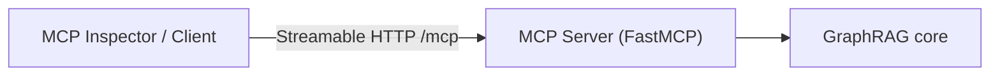
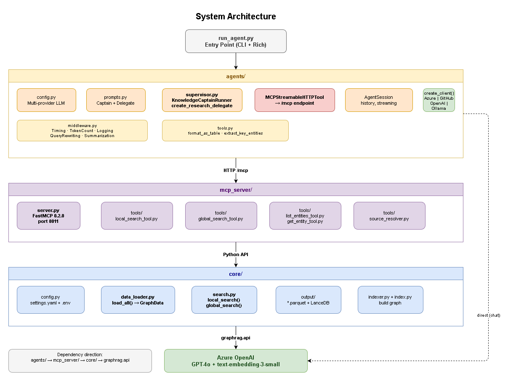
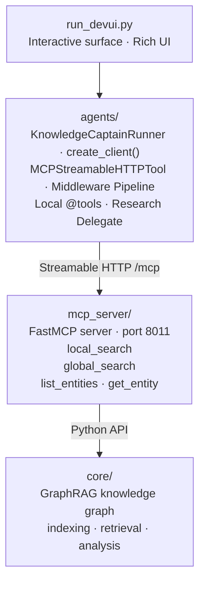
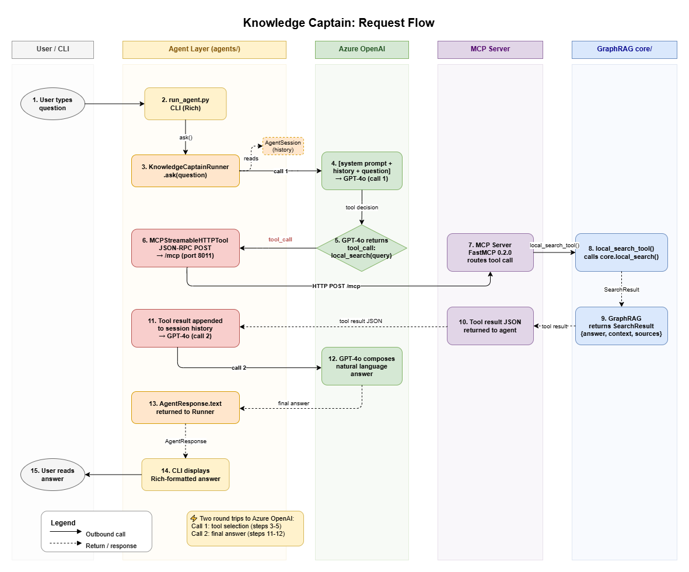
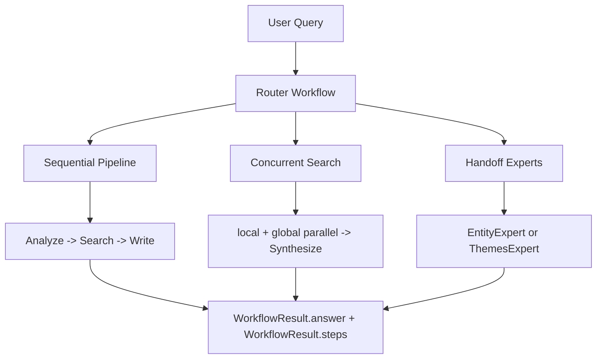
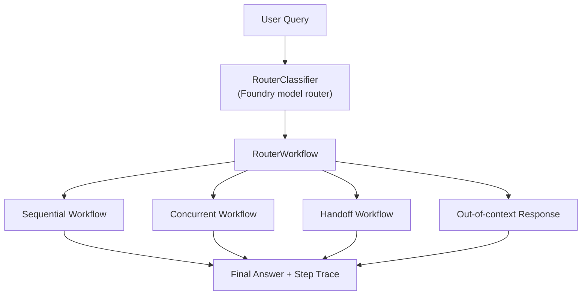

# MAF + GraphRAG Series

Building Knowledge Graphs with Microsoft GraphRAG and Azure OpenAI.

[](https://sonarcloud.io/summary/new_code?id=cristofima_maf-graphrag-series)
[](https://sonarcloud.io/summary/new_code?id=cristofima_maf-graphrag-series)
[](https://sonarcloud.io/summary/new_code?id=cristofima_maf-graphrag-series)
[](https://sonarcloud.io/summary/new_code?id=cristofima_maf-graphrag-series)
[](https://sonarcloud.io/summary/new_code?id=cristofima_maf-graphrag-series)
[](https://sonarcloud.io/summary/new_code?id=cristofima_maf-graphrag-series)
[](https://sonarcloud.io/summary/new_code?id=cristofima_maf-graphrag-series)

## Series Overview

This repository contains the code for the **MAF + GraphRAG** article series, demonstrating enterprise-grade knowledge graph integration with Microsoft GraphRAG and Azure OpenAI.

## Core Stack

Use the root README for high-level stack families only. Exact dependency pins live in `pyproject.toml`.

| Technology      | Version Family | Purpose                                  |
| --------------- | -------------- | ---------------------------------------- |
| GraphRAG        | `3.0.x`        | Knowledge graph indexing and retrieval   |
| Agent Framework | `1.13.x`       | Agents, orchestration, and model clients |
| FastMCP         | `3.4.x`        | MCP server hosting over Streamable HTTP  |

| Part | Title                            | Status      | Folder/Module                                      |
| ---- | -------------------------------- | ----------- | -------------------------------------------------- |
| 1    | GraphRAG Fundamentals            | ✅ Complete | `src/core/`                                        |
| 2    | GraphRAG MCP Server              | ✅ Complete | `src/mcp_server/`                                  |
| 3    | Supervisor Agent Pattern         | ✅ Complete | `src/agents/`                                      |
| 4    | Workflow Patterns                | ✅ Complete | `src/workflows/`                                   |
| 5    | Agent Evaluation                 | ✅ Complete | `src/evaluation/`                                  |
| 6    | Router SLM Integration           | ✅ Complete | `src/agents/`, `src/workflows/`, `src/evaluation/` |
| 7    | Conversational Session Readiness | ⏳ Planned  | —                                                  |
| 8    | Human-in-the-Loop                | ⏳ Planned  | —                                                  |
| 9    | Tool Registry                    | ⏳ Planned  | —                                                  |
| 10   | Production Deployment            | ⏳ Planned  | —                                                  |

## Part 1: GraphRAG Fundamentals

Learn the basics of Microsoft GraphRAG - transforming documents into knowledge graphs for complex reasoning.

### What You'll Learn

- Microsoft Research GraphRAG fundamentals
- Entity extraction from documents
- Relationship detection between entities
- Community detection (Leiden algorithm)
- Local vs Global search strategies

### Why GraphRAG (Not Standard RAG)?

| Question Type                                    | Standard RAG | GraphRAG |
| ------------------------------------------------ | ------------ | -------- |
| "Find similar documents"                         | ✅           | ✅       |
| "What is the relationship between X and Y?"      | ❌           | ✅       |
| "What are all the connections to Project Alpha?" | ❌           | ✅       |
| "What themes span the entire organization?"      | ❌           | ✅       |

### Prerequisites

- **Python 3.11+** (tested with 3.11 and 3.12)
- **uv** for dependency and environment management
- Azure OpenAI resource with:
  - GPT-4o deployment (for entity extraction and queries)
  - text-embedding-3-small deployment (for embeddings)
- Azure subscription

### Quick Start

```powershell
# Install uv (if not installed)
# Windows PowerShell:
powershell -ExecutionPolicy ByPass -c "irm https://astral.sh/uv/install.ps1 | iex"

# Linux/macOS:
# curl -LsSf https://astral.sh/uv/install.sh | sh

# Clone the repository
git clone https://github.com/cristofima/maf-graphrag-series.git
cd maf-graphrag-series

# Install dependencies and create .venv
uv sync --dev

# Configure environment variables
cp .env.example .env
# Edit .env with your Azure OpenAI credentials

# Build the knowledge graph
uv run python -m core.index

# Query the knowledge graph
uv run python -m core.example "Who leads Project Alpha?"
uv run python -m core.example "What are the main projects?" --type global
```

💡 **Note:** uv creates and manages `.venv` automatically in the project folder when you run `uv sync`.

📖 **uv Guide:** See [docs/uv-guide.md](docs/uv-guide.md) for detailed usage instructions.

### Using the Python API

The `src/core/` module provides a modern Python API for GraphRAG knowledge graph operations:

#### Building the Knowledge Graph

```python
import asyncio
from core import build_index

# Build knowledge graph from documents in input/documents/
results = asyncio.run(build_index())

for result in results:
    print(f"{result.workflow}: {result.errors or 'success'}")
```

Or use the CLI:

```powershell
uv run python -m core.index
uv run python -m core.index --resume  # Resume interrupted run
```

#### Querying the Knowledge Graph

```python
import asyncio
from core import load_all, local_search, global_search

# Load the knowledge graph
data = load_all()
print(f"Loaded: {data.entities.shape[0]} entities, {data.relationships.shape[0]} relationships")

# Entity-focused search
response, context = asyncio.run(local_search("Who leads Project Alpha?", data))
print(response)

# Thematic search
response, context = asyncio.run(global_search("What are the main projects?", data))
print(response)
```

Or use the CLI:

```powershell
uv run python -m core.example "Who leads Project Alpha?"
uv run python -m core.example "What are the main themes?" --type global
```

📖 **API Documentation:** See [src/core/README.md](src/core/README.md) for full API reference.

## Part 2: GraphRAG MCP Server

Expose GraphRAG as an MCP (Model Context Protocol) server for AI agent integration.

### What You'll Learn

- Model Context Protocol (MCP) fundamentals
- FastMCP server implementation
- MCP tool design patterns
- Testing with MCP Inspector
- Agent-to-knowledge-graph communication

### Why MCP?

MCP enables agents to access external tools and data sources dynamically:

| Pattern              | Description                                 | Use Case                        |
| -------------------- | ------------------------------------------- | ------------------------------- |
| **Direct API calls** | Agent calls functions directly              | Simple, single-agent scenarios  |
| **MCP Tools**        | Agent discovers and uses tools via protocol | Multi-agent, extensible systems |
| **Tool composition** | Multiple MCP servers, single agent          | Enterprise knowledge access     |

### Quick Start

```bash
# Install Part 2 dependencies
uv sync --dev

# Option 1: Test in notebook (recommended, no server needed)
jupyter notebook notebooks/02_test_mcp_server.ipynb

# Option 2: Start MCP Server + use MCP Inspector
uv run python run_mcp_server.py
npx @modelcontextprotocol/inspector   # Opens browser UI at http://localhost:6274
```

### Architecture


```mermaid
flowchart LR
    I["MCP Inspector / Client"] -->|"Streamable HTTP /mcp"| M["MCP Server (FastMCP)"]
    M --> C["GraphRAG core"]
```

### MCP Tools Exposed

| Tool                     | Purpose               | Example Query                           |
| ------------------------ | --------------------- | --------------------------------------- |
| `search_knowledge_graph` | Main entry point      | Any question with search_type parameter |
| `local_search`           | Entity-focused search | "Who leads Project Alpha?"              |
| `global_search`          | Thematic search       | "What are the main projects?"           |
| `list_entities`          | Browse entities       | "List all projects"                     |
| `get_entity`             | Entity details        | "Details about Dr. Emily Harrison"      |

### Testing with MCP Inspector

The [MCP Inspector](https://modelcontextprotocol.io/docs/tools/inspector) is the recommended way to interact with the server during development:

```bash
# Terminal 1: Start MCP Server
uv run python run_mcp_server.py

# Terminal 2: Launch MCP Inspector
npx @modelcontextprotocol/inspector
```

In the Inspector UI:

1. Set transport to **Streamable HTTP** and URL to `http://localhost:8011/mcp`
2. Click **Connect** → Tools tab shows all 5 tools
3. Select a tool, fill in parameters, click **Run**

📖 **MCP Documentation:** See [src/mcp_server/README.md](src/mcp_server/README.md) for complete documentation.

## Part 3: Supervisor Agent Pattern

Build the Knowledge Captain: a conversational agent that connects to the GraphRAG MCP server and automatically routes questions to the right search tool.

### What You'll Learn

- Microsoft Agent Framework fundamentals
- `MCPStreamableHTTPTool` for MCP server integration
- `Agent` as async context manager for automatic MCP lifecycle management
- System prompt-based tool routing (GPT-4o decides which MCP tool to call)
- Foundry Model Router integration (Azure OpenAI deployments only)
- Three-layer middleware pipeline (timing, token counting, logging, query rewriting)
- Local `@tool` functions and research delegate sub-agent
- `AgentSession` for conversation memory across multiple turns
- Streamable HTTP (`/mcp`) transport for MCP connectivity

### Architecture




```mermaid
flowchart TD
    A["run_devui.py<br/>Interactive surface · Rich UI"]
    B["agents/<br/>KnowledgeCaptainRunner · create_client()<br/>MCPStreamableHTTPTool · Middleware Pipeline<br/>Local @tools · Research Delegate"]
    C["mcp_server/<br/>FastMCP server · port 8011<br/>local_search<br/>global_search<br/>list_entities · get_entity"]
    D["core/<br/>GraphRAG knowledge graph<br/>indexing · retrieval · analysis"]

    A --> B
    B -->|"Streamable HTTP /mcp"| C
    C -->|"Python API"| D
```

### Request Flow



_Two round trips to Azure OpenAI per query: call 1 selects the tool, call 2 composes the answer._

### Quick Start

```bash
# Install dependencies
uv sync --dev

# Start MCP server (Terminal 1)
uv run python run_mcp_server.py

# Interactive surface (Terminal 2)
uv run python run_devui.py
```

### Key Pattern: System Prompt Routing

The agent uses its system prompt to decide which MCP tool to call—no separate routing logic needed:

| Question Type  | Tool Selected   | Example                            |
| -------------- | --------------- | ---------------------------------- |
| Entity-focused | `local_search`  | "Who leads Project Alpha?"         |
| Thematic       | `global_search` | "What are the main projects?"      |
| Entity details | `get_entity`    | "Details about Dr. Emily Harrison" |

### Usage Example

```python
from agents import KnowledgeCaptainRunner

async with KnowledgeCaptainRunner() as runner:
    # First question
    response = await runner.ask("Who leads Project Alpha?")
    print(response.text)

    # Follow-up (has context from previous question)
    response = await runner.ask("What is their background?")
    print(response.text)

    # Reset conversation
    runner.clear_history()
```

### Microsoft Agent Framework Patterns

Key patterns used:

| Pattern                          | Description                                                            |
| -------------------------------- | ---------------------------------------------------------------------- |
| `Agent` as async context manager | `async with agent:` auto-manages MCP tool connect/close lifecycle      |
| `MCPStreamableHTTPTool`          | Connect to MCP servers via Streamable HTTP                             |
| `tool_name_prefix`               | Avoids duplicate tool names when multiple agents share the same server |
| Foundry router `create_client()` | Targets Azure OpenAI deployments and captures router metadata          |
| Middleware pipeline              | `TimingAgent`, `TokenCounting`, `LoggingFunction`, `QueryRewriting`    |
| Local `@tool` functions          | `format_as_table`, `extract_key_entities` — no MCP round-trip          |
| `create_research_delegate()`     | Context-isolated sub-agent for deep knowledge graph searches           |
| `AgentSession`                   | Conversation memory across multiple turns                              |

📖 **Agents Documentation:** See [src/agents/README.md](src/agents/README.md) for complete API reference.

### Knowledge Graph Statistics

After indexing the 10 sample documents, the knowledge graph contains:

| Metric            | Count |
| ----------------- | ----- |
| **Entities**      | 147   |
| **Relationships** | 263   |
| **Communities**   | 32    |
| **Documents**     | 10    |
| **Text Units**    | 20    |

### Project Structure

```
maf-graphrag-series/
├── README.md
├── pyproject.toml             # Project and dependency configuration
├── uv.lock                    # Locked dependency versions
├── settings.yaml              # GraphRAG configuration
├── .env.example
├── run_devui.py               # DevUI entry point (interactive exploration)
├── run_mcp_server.py          # Start MCP server (Part 2)
├── run_router_chatbot.py      # Router-only chatbot endpoint (/api/messages)
├── input/
│   ├── README.md              # Document descriptions
│   └── documents/             # 10 sample interconnected documents
│       ├── company_org.md
│       ├── team_members.md
│       ├── project_alpha.md
│       ├── project_beta.md
│       ├── technical_architecture.md
│       ├── technology_stack.md
│       ├── customers_partners.md
│       ├── engineering_processes.md
│       ├── incidents_postmortems.md
│       └── company_events_timeline.md
├── output/                    # Generated knowledge graph
│   ├── *.parquet
│   └── lancedb/               # Vector store
├── src/                       # Application source code
│   ├── core/                  # Part 1: Python API for GraphRAG
│   │   ├── __init__.py        # Module exports
│   │   ├── classification_utils.py # Shared confidence parsing utilities
│   │   ├── config.py          # Configuration loading
│   │   ├── data_loader.py     # Parquet file loading
│   │   ├── indexer.py         # Build knowledge graph
│   │   ├── search.py          # Async search functions
│   │   ├── index.py           # CLI for indexing
│   │   ├── example.py         # CLI for querying
│   │   └── README.md          # Module documentation
│   ├── mcp_server/            # Part 2: MCP Server
│   │   ├── __init__.py        # Package exports
│   │   ├── server.py          # FastMCP server
│   │   ├── config.py          # MCP configuration
│   │   ├── tools/             # MCP tools
│   │   │   ├── __init__.py        # Tool exports
│   │   │   ├── _data_cache.py     # Lazy singleton cache for GraphRAG data
│   │   │   ├── types.py           # TypedDicts and validation helpers
│   │   │   ├── local_search.py    # Entity-focused search (with source traceability)
│   │   │   ├── global_search.py   # Thematic search (community reports only)
│   │   │   ├── entity_query.py    # Entity lookup
│   │   │   └── source_resolver.py # Resolves text unit IDs → document titles
│   │   └── README.md          # MCP documentation
│   ├── agents/                # Part 3: Conversational Agent
│   │   ├── __init__.py        # Public API re-exports
│   │   ├── config.py          # Foundry router configuration and metadata helpers
│   │   ├── middleware.py      # Three-layer observability middleware pipeline
│   │   ├── prompts.py         # Knowledge Captain & Research Delegate prompts
│   │   ├── router_classifier.py # Router classifier used by Router workflow
│   │   ├── supervisor.py      # KnowledgeCaptainRunner, research delegate, MCP tool
│   │   ├── tools.py           # Local @tool functions (format_as_table, extract_key_entities)
│   │   └── README.md          # Agents documentation
│   ├── workflows/             # Part 4: Multi-agent orchestration
│   │   ├── __init__.py        # Public API exports
│   │   ├── base.py            # WorkflowResult, WorkflowStep, MCPWorkflowBase, factory functions
│   │   ├── sequential.py      # Research Pipeline workflow
│   │   ├── concurrent.py      # Parallel Search workflow
│   │   ├── handoff.py         # Expert Routing workflow
│   │   ├── router.py          # Production router workflow
│   │   └── README.md          # Workflows documentation
│   └── evaluation/            # Part 5: Agent evaluation pipeline
│       ├── __init__.py        # Package exports
│       ├── config.py          # EvalConfig — Azure AI Evaluation SDK configuration
│       ├── evaluators/        # Built-in (LLM-judge) + custom graph-based evaluators
│       ├── monitoring/        # OpenTelemetry setup for Application Insights tracing
│       ├── scripts/           # generate_eval_data, run_batch_evaluation, run_redteam
│       └── README.md          # Evaluation documentation
├── tests/                     # Test suite
├── infra/                     # Terraform infrastructure
├── docs/                      # Technical documentation
├── prompts/                   # Custom GraphRAG prompt templates
└── notebooks/
    ├── 01_explore_graph.ipynb      # Part 1: Graph visualization
    └── 02_test_mcp_server.ipynb    # Part 2: MCP server testing
```

## Sample Q&A Results

### Local Search (Entity-Focused)

**Question:** "Who resolved the GraphRAG index corruption incident and what was the root cause?"

**Answer:**

> The GraphRAG index corruption incident was resolved through the collaborative efforts of Sophia Lee, Priya Patel, Dr. Emily Harrison, and David Kumar. The root cause was identified as an interrupted indexing job during an Azure Container Apps scaling event, which left the graph in an inconsistent state. The resolution involved implementing a full re-index with validation checks and atomic swap procedures.

**Question:** "Who leads Project Alpha and what is their background?"

**Answer:**

> Dr. Emily Harrison leads Project Alpha at TechVenture Inc. She holds a Ph.D. in Quantum Computing from MIT and has 15 years of experience in advanced computing research. Under her leadership, Project Alpha is developing a next-generation quantum-classical hybrid processor that has achieved 99.7% gate fidelity.

### Global Search (Thematic)

**Question:** "What are the main initiatives at TechVenture?"

**Answer:**

> TechVenture Inc. is pursuing major strategic initiatives:
>
> 1. **Project Alpha** - Quantum computing research led by Dr. Emily Harrison (Phase 4 - GA Preparation)
> 2. **Project Beta** - AI/ML platform for healthcare applications (Active production with enterprise customers)
>
> These projects share resources through cross-functional collaboration, with teams spanning Research, Engineering, and Infrastructure departments.

See [docs/qa-examples.md](docs/qa-examples.md) for more examples.

---

## Part 4: Workflow Patterns

Extend the single Knowledge Captain agent with multi-agent workflow patterns that chain, parallelize, and route between specialized agents.

### What You'll Learn

- **Router Workflow** — production entry point: Foundry classifier delegates to the best pattern
- **Sequential Workflow** — chain agents in a research pipeline (Analyze → Search → Write)
- **Concurrent Workflow** — run local + global search in parallel via `asyncio.gather`, then synthesize
- **Handoff Workflow** — explicit Router agent routes queries to EntityExpert or ThemesExpert
- When to use each pattern and how they complement each other
- How `WorkflowResult.steps` provides full traceability across all agents

### Workflow Patterns

| Pattern    | Agents/Steps                                  | Best For                          |
| ---------- | --------------------------------------------- | --------------------------------- |
| Router     | Foundry RouterClassifier → delegated workflow | Production chatbot/API entrypoint |
| Sequential | QueryAnalyzer → KnowledgeSearcher → Writer    | Complex multi-part research       |
| Concurrent | EntitySearcher ∥ ThemesSearcher → Synthesis   | Dual-perspective questions        |
| Handoff    | Router → EntityExpert \| ThemesExpert         | Auditable specialist routing      |

### Quick Start

```bash
# Prerequisites (same as Part 3)
uv run python run_mcp_server.py          # Terminal 1

# DevUI workflow exploration
uv run python run_devui.py               # Terminal 2
```

Prompt examples for router/sequential/concurrent/handoff are maintained in
[src/workflows/README.md](src/workflows/README.md).

### Architecture


```mermaid
flowchart TD
    Q["User Query"] --> R["Router Workflow"]
    R --> S["Sequential Pipeline"]
    R --> C["Concurrent Search"]
    R --> H["Handoff Experts"]

    S --> SA["Analyze -> Search -> Write"]
    C --> CA["local + global parallel -> Synthesize"]
    H --> HA["EntityExpert or ThemesExpert"]

    SA --> O["WorkflowResult.answer + WorkflowResult.steps"]
    CA --> O
    HA --> O
```

### Usage Example

```python
from workflows import ResearchPipelineWorkflow, ParallelSearchWorkflow, ExpertHandoffWorkflow

# Sequential: structured research pipeline
async with ResearchPipelineWorkflow() as wf:
    result = await wf.run("What is the technology strategy for Project Alpha?")
    print(result.answer)
    print(result.step_summary())  # Shows all steps with timing

# Concurrent: parallel local + global search
async with ParallelSearchWorkflow() as wf:
    result = await wf.run("Who leads the main projects and what are the key themes?")
    print(result.answer)

# Handoff: explicit router → specialist
async with ExpertHandoffWorkflow() as wf:
    result = await wf.run("Who leads Project Alpha?")   # → EntityExpert
    result = await wf.run("What are the initiatives?")  # → ThemesExpert
    print(result.answer)
```

📖 **Workflows Documentation:** See [src/workflows/README.md](src/workflows/README.md) for complete reference.

---

## Part 5: Agent Evaluation

End-to-end evaluation pipeline: LLM-as-judge quality metrics, custom graph-based evaluators, OpenTelemetry tracing, and optional red team safety scanning.

### What You'll Learn

- Azure AI Evaluation SDK (`TaskAdherence`, `IntentResolution`, semantic quality evaluators)
- Custom evaluators that validate against the GraphRAG Parquet knowledge graph (no LLM needed)
- MAF agent observability with OpenTelemetry and Application Insights
- Red team safety scanning with `RedTeam` (requires Azure AI Foundry)

Batch evaluation outputs include aggregate metric reports, token usage, and optional Foundry-linked traces.

`ToolCallAccuracyEvaluator` appears only when the evaluation dataset includes structured `tool_call` payloads.

### Evaluation Pipeline

| Step | Script                    | What it does                                         |
| ---- | ------------------------- | ---------------------------------------------------- |
| 1    | `run_mcp_server.py`       | Start the MCP server (prerequisite)                  |
| 2    | `generate_eval_data.py`   | Run agent on 10 golden questions → `eval_data.jsonl` |
| 3    | `run_batch_evaluation.py` | Built-in + custom evaluators, write results + report |
| 4    | `run_redteam.py`          | Safety scan (optional, requires Azure AI Foundry)    |

### Quick Start

```powershell
# Terminal 1: Start MCP server
uv run python run_mcp_server.py

# Terminal 2: Full pipeline
uv run python -m evaluation.scripts.generate_eval_data
uv run python -m evaluation.scripts.run_batch_evaluation

# With Foundry dashboard
uv run python -m evaluation.scripts.run_batch_evaluation --foundry

# Red team scan (requires AZURE_AI_PROJECT)
uv run python -m evaluation.scripts.run_redteam
```

**Configuration note**: keep `AZURE_OPENAI_API_VERSION` and `AZURE_OPENAI_EVAL_API_VERSION` independently configurable. Azure AI Evaluation endpoints can require a different API version than the chat and workflow runtime. See [src/evaluation/README.md](src/evaluation/README.md) for the current evaluator configuration guidance.

### Evaluators

| Evaluator                       | Type                    | What it measures                                             |
| ------------------------------- | ----------------------- | ------------------------------------------------------------ |
| `TaskAdherenceEvaluator`        | LLM-judge               | Does the response complete the task?                         |
| `IntentResolutionEvaluator`     | LLM-judge               | Does the response address user intent?                       |
| `RelevanceEvaluator`            | LLM-judge               | Is the response relevant to the query?                       |
| `CoherenceEvaluator`            | LLM-judge               | Is the response logically consistent?                        |
| `ResponseCompletenessEvaluator` | LLM-judge               | Does the response cover expected content?                    |
| `ToolCallAccuracyEvaluator`     | LLM-judge (conditional) | Were the right graph tools called correctly?                 |
| `EntityAccuracyEvaluator`       | Graph Parquet           | Are named entities in the response valid graph entities?     |
| `RelationshipValidityEvaluator` | Graph Parquet           | Do entity co-occurrences reflect actual graph relationships? |

### Screenshot Guidance

For documentation clarity, use this split:

| Screenshot                                                     | Best location              | Reason                                                      |
| -------------------------------------------------------------- | -------------------------- | ----------------------------------------------------------- |
| Evaluations list page                                          | Root README                | High-level proof that batch evaluation runs are completing. |
| Red team list page                                             | Root README                | High-level proof that safety scans are running.             |
| Batch run details page with metrics table                      | `src/evaluation/README.md` | Step 3 metric interpretation and troubleshooting.           |
| Red team run details page with ASR columns and attack outcomes | `src/evaluation/README.md` | Step 4 safety evidence and attack-level analysis.           |

📖 **Evaluation Documentation:** See [src/evaluation/README.md](src/evaluation/README.md) for the complete reference.

---

## Part 6: Router SLM Integration

Move from pattern demos to a production router posture where all user traffic enters through `RouterWorkflow` and routes to sequential, concurrent, handoff, or `out_of_context` response paths.

### What You'll Learn

- Foundry-first router classifier integration with Agent Framework client path
- Production fallback policy (retry transient classifier errors, then degrade to sequential)
- Router metadata contract for observability (`classified_workflow`, `routed_workflow`, confidence, fallback reason)
- DevUI and connector-style chatbot surfaces that both execute the same router workflow backend
- Staged CI governance for router evaluation (PR local gate, `main` Foundry publish + optional red team)

### Production Routing Contract

`RouterWorkflow` is the production entry point and enforces deterministic behavior:

| Rule                               | Behavior                                                |
| ---------------------------------- | ------------------------------------------------------- |
| Classifier confidence threshold    | Route as classified when confidence >= 80               |
| Transient classifier failures      | Retry, then continue if recovered                       |
| Non-retryable / exhausted failures | Fallback to sequential with explicit metadata           |
| Unknown workflow label             | Fallback to sequential                                  |
| `out_of_context` label             | Return safe direct response path (no retrieval fan-out) |

### Architecture


```mermaid
flowchart TD
        Q["User Query"] --> RC["RouterClassifier\n(Foundry model router)"]
        RC --> RW["RouterWorkflow"]
        RW --> SQ["Sequential Workflow"]
        RW --> CC["Concurrent Workflow"]
        RW --> HF["Handoff Workflow"]
        RW --> OOC["Out-of-context Response"]
        SQ --> OUT["Final Answer + Step Trace"]
        CC --> OUT
        HF --> OUT
        OOC --> OUT
```

### Runtime Surfaces

| Surface             | Entry Point                           | Purpose                                                                          |
| ------------------- | ------------------------------------- | -------------------------------------------------------------------------------- |
| DevUI               | `uv run python run_devui.py`          | Interactive workflow visualization and timeline tracing                          |
| Teams/Connector API | `uv run python run_router_chatbot.py` | `/api/messages` endpoint for Microsoft 365 Agents Playground or Bot integrations |

### Quick Start

```powershell
# Terminal 1: MCP server (tool backend)
uv run python run_mcp_server.py

# Terminal 2: DevUI router surface
uv run python run_devui.py

# Optional Terminal 3: Connector endpoint for Agents Playground
uv run python run_router_chatbot.py
```

### Microsoft 365 Agents Playground

Agents Playground is an external CLI for local chat testing. It is not installed from PyPI and is not bundled with this repository.

Install one of these ways:

```powershell
# Windows standalone install
winget install agentsplayground

# Cross-platform npm install
npm install -g @microsoft/m365agentsplayground
```

Then launch it against the local router endpoint:

```powershell
agentsplayground -e http://localhost:3978/api/messages -c msteams
```

This flow is also documented in [src/workflows/README.md](src/workflows/README.md), which contains the connector-focused setup notes and Microsoft Learn references.

### Part 6 Screenshots

**DevUI**


_DevUI router execution view with workflow graph, execution timeline, and events panel._

**Microsoft 365 Agents Playground**


_Microsoft 365 Agents Playground conversation showing routed responses across GraphRAG workflows._

📖 **Part 6 Implementation Notes:** See [docs/part6-implementation-notes.md](docs/part6-implementation-notes.md) for routing policy, CI governance, and rollout details.

---

## Azure AI Services Used

| Service                  | Purpose                    | Tooling                       |
| ------------------------ | -------------------------- | ----------------------------- |
| **Azure OpenAI**         | Entity extraction, queries | GPT-4o                        |
| **Azure OpenAI**         | Document embeddings        | text-embedding-3-small        |
| **Agent Framework**      | Multi-agent orchestration  | Agent Framework SDK           |
| **Azure AI Evaluation**  | LLM-as-judge + red team    | Azure AI Evaluation SDK       |
| **Application Insights** | Agent observability traces | OpenTelemetry + Azure Monitor |

## Testing

The test suite mirrors `src/` under `tests/` (pytest + pytest-asyncio, `asyncio_mode = "auto"`). All Azure OpenAI calls are mocked — no credentials or live endpoints are required to run tests.

```bash
uv run pytest                     # Full suite with coverage report
uv run pytest tests/agents/       # Run a single module
uv run pytest --cov-report=html   # HTML coverage report (htmlcov/)
```

| Area                                                    | Coverage | Notes                                               |
| ------------------------------------------------------- | -------- | --------------------------------------------------- |
| `core`, `agents`, `mcp_server`, `workflows`             | 100%     | `core/example.py` (standalone demo script) excluded |
| `evaluation` — config, evaluators, monitoring, data gen | 100%     |                                                     |
| `evaluation` — `run_batch_evaluation`, `run_redteam`    | Low      | Long-running, interactive CLI scripts — deferred    |

The overall percentage moves as the suite grows — see the live **Coverage** badge above or [SonarCloud](https://sonarcloud.io/summary/new_code?id=cristofima_maf-graphrag-series) for the current number rather than a number pinned here.

Ruff (lint + format) and mypy run in CI alongside tests — see [.github/workflows/ci.yml](.github/workflows/ci.yml).

## Key Files

| File              | Description                                               |
| ----------------- | --------------------------------------------------------- |
| `settings.yaml`   | GraphRAG configuration (LLM, embeddings, storage)         |
| `src/core/`       | Python API module for indexing, querying, and data access |
| `src/mcp_server/` | MCP server exposing GraphRAG tools                        |
| `src/agents/`     | Knowledge Captain conversational agent                    |
| `src/workflows/`  | Multi-agent workflow patterns                             |
| `src/evaluation/` | Evaluation pipeline — evaluators, monitoring, scripts     |
| `.env`            | Azure OpenAI credentials (create from .env.example)       |

## License

MIT License - See [LICENSE](LICENSE) for details.

## Author

Cristopher Coronado
