# MAF + GraphRAG Series

Building Knowledge Graphs with Microsoft GraphRAG and Azure OpenAI.

## Series Overview

This repository contains the code for the **MAF + GraphRAG** article series, demonstrating enterprise-grade knowledge graph integration with Microsoft GraphRAG and Azure OpenAI.

| Part | Title | Status | Folder/Module |
|------|-------|--------|---------------|
| 1 | GraphRAG Fundamentals | ✅ Complete | `core/` |
| 2 | GraphRAG MCP Server | ✅ Complete | `mcp_server/` |
| 3 | Supervisor Agent Pattern | ✅ Complete | `agents/` |
| 4 | Workflow Patterns | ⏳ Planned | `workflows/` |
| 5 | Agent Evaluation | ⏳ Planned | `evaluation/` |
| 6 | Human-in-the-Loop | ⏳ Planned | `middleware/` |
| 7 | Tool Registry | ⏳ Planned | `registry/` |
| 8 | Production Deployment | ⏳ Planned | `deploy/` |

## Part 1: GraphRAG Fundamentals

Learn the basics of Microsoft GraphRAG - transforming documents into knowledge graphs for complex reasoning.

### What You'll Learn

- Microsoft Research GraphRAG fundamentals
- Entity extraction from documents
- Relationship detection between entities
- Community detection (Leiden algorithm)
- Local vs Global search strategies

### Why GraphRAG (Not Standard RAG)?

| Question Type | Standard RAG | GraphRAG |
|---------------|-------------|----------|
| "Find similar documents" | ✅ | ✅ |
| "What is the relationship between X and Y?" | ❌ | ✅ |
| "What are all the connections to Project Alpha?" | ❌ | ✅ |
| "What themes span the entire organization?" | ❌ | ✅ |

### Prerequisites

- **Python 3.10+** (tested with 3.11)
- **Poetry** for dependency management
- Azure OpenAI resource with:
  - GPT-4o deployment (for entity extraction and queries)
  - text-embedding-3-small deployment (for embeddings)
- Azure subscription

### Quick Start

```powershell
# Install Poetry (if not installed)
# Windows PowerShell:
(Invoke-WebRequest -Uri https://install.python-poetry.org -UseBasicParsing).Content | py -

# Linux/macOS:
# curl -sSL https://install.python-poetry.org | python3 -

# Clone the repository
git clone https://github.com/cristofima/maf-graphrag-series.git
cd maf-graphrag-series

# RECOMMENDED: Configure Poetry to create .venv in project folder
poetry config virtualenvs.in-project true

# Install dependencies (Poetry creates virtual environment automatically)
poetry install

# Configure environment variables
cp .env.example .env
# Edit .env with your Azure OpenAI credentials

# Build the knowledge graph
poetry run python -m core.index

# Query the knowledge graph
poetry run python -m core.example "Who leads Project Alpha?"
poetry run python -m core.example "What are the main projects?" --type global
```

💡 **Note:** Poetry manages virtual environments automatically. You don't need to manually create `.venv` like with pip.

📖 **Poetry Guide:** See [docs/poetry-guide.md](docs/poetry-guide.md) for detailed usage instructions.

### Using the Python API

The `core/` module provides a modern Python API for GraphRAG 3.0.x:

#### Building the Knowledge Graph

```python
import asyncio
from core import build_index

# Build knowledge graph from documents in input/documents/
results = asyncio.run(build_index())

for result in results:
    print(f"{result.workflow}: {result.errors or 'success'}")
```

Or use the CLI:

```powershell
poetry run python -m core.index
poetry run python -m core.index --resume  # Resume interrupted run
```

#### Querying the Knowledge Graph

```python
import asyncio
from core import load_all, local_search, global_search

# Load the knowledge graph
data = load_all()
print(f"Loaded: {data.entities.shape[0]} entities, {data.relationships.shape[0]} relationships")

# Entity-focused search
response, context = asyncio.run(local_search("Who leads Project Alpha?", data))
print(response)

# Thematic search
response, context = asyncio.run(global_search("What are the main projects?", data))
print(response)
```

Or use the CLI:

```powershell
poetry run python -m core.example "Who leads Project Alpha?"
poetry run python -m core.example "What are the main themes?" --type global
```

📖 **API Documentation:** See [core/README.md](core/README.md) for full API reference.

## Part 2: GraphRAG MCP Server

Expose GraphRAG as an MCP (Model Context Protocol) server for AI agent integration.

### What You'll Learn

- Model Context Protocol (MCP) fundamentals
- FastMCP server implementation
- MCP tool design patterns
- Testing with MCP Inspector
- Agent-to-knowledge-graph communication

### Why MCP?

MCP enables agents to access external tools and data sources dynamically:

| Pattern | Description | Use Case |
|---------|-------------|----------|
| **Direct API calls** | Agent calls functions directly | Simple, single-agent scenarios |
| **MCP Tools** | Agent discovers and uses tools via protocol | Multi-agent, extensible systems |
| **Tool composition** | Multiple MCP servers, single agent | Enterprise knowledge access |

### Quick Start

```bash
# Install Part 2 dependencies
poetry install

# Option 1: Test in notebook (recommended, no server needed)
jupyter notebook notebooks/02_test_mcp_server.ipynb

# Option 2: Start MCP Server + use MCP Inspector
poetry run python run_mcp_server.py
npx @modelcontextprotocol/inspector   # Opens browser UI at http://localhost:6274
```

### Architecture

```
MCP Inspector / Client → Streamable HTTP (/mcp) → MCP Server (FastMCP) → GraphRAG (core/)
```

### MCP Tools Exposed

| Tool | Purpose | Example Query |
|------|---------|---------------|
| `search_knowledge_graph` | Main entry point | Any question with search_type parameter |
| `local_search` | Entity-focused search | "Who leads Project Alpha?" |
| `global_search` | Thematic search | "What are the main projects?" |
| `list_entities` | Browse entities | "List all projects" |
| `get_entity` | Entity details | "Details about Dr. Emily Harrison" |

### Testing with MCP Inspector

The [MCP Inspector](https://modelcontextprotocol.io/docs/tools/inspector) is the recommended way to interact with the server during development:

```bash
# Terminal 1: Start MCP Server
poetry run python run_mcp_server.py

# Terminal 2: Launch MCP Inspector
npx @modelcontextprotocol/inspector
```

In the Inspector UI:
1. Set transport to **Streamable HTTP** and URL to `http://localhost:8011/mcp`
2. Click **Connect** → Tools tab shows all 5 tools
3. Select a tool, fill in parameters, click **Run**

📖 **MCP Documentation:** See [mcp_server/README.md](mcp_server/README.md) for complete documentation.

## Part 3: Supervisor Agent Pattern

Build the Knowledge Captain: a conversational agent that connects to the GraphRAG MCP server and automatically routes questions to the right search tool.

### What You'll Learn

- Microsoft Agent Framework fundamentals (1.0.0b260212)
- `MCPStreamableHTTPTool` for MCP server integration
- System prompt-based tool routing (GPT-4o decides, no code router)
- `AgentSession` for conversation memory across multiple turns
- MCP transport upgrade: SSE (`/sse`) → Streamable HTTP (`/mcp`)
- Azure OpenAI client configuration with Azure Identity support

### Architecture




```mermaid
flowchart TD
    A["run_agent.py<br/>CLI entry point · Rich"]
    B["agents/<br/>KnowledgeCaptainRunner · GPT-4o<br/>MCPStreamableHTTPTool · AgentSession"]
    C["mcp_server/<br/>FastMCP 0.2.0 · port 8011<br/>local_search<br/>global_search<br/>list_entities · get_entity"]
    D["core/<br/>GraphRAG 3.0.1<br/>147 entities<br/>263 relationships<br/>32 communities"]

    A --> B
    B -->|"Streamable HTTP /mcp"| C
    C -->|"Python API"| D
```

### Request Flow


*Two round trips to Azure OpenAI per query: call 1 selects the tool, call 2 composes the answer.*

### Quick Start

```bash
# Install dependencies
poetry install

# Start MCP server (Terminal 1)
poetry run python run_mcp_server.py

# Interactive agent (Terminal 2)
poetry run python run_agent.py
```

### Key Pattern: System Prompt Routing

The agent uses its system prompt to decide which MCP tool to call—no separate routing logic needed:

| Question Type | Tool Selected | Example |
|---------------|---------------|---------|
| Entity-focused | `local_search` | "Who leads Project Alpha?" |
| Thematic | `global_search` | "What are the main projects?" |
| Entity details | `get_entity` | "Details about Dr. Emily Harrison" |

### Usage Example

```python
from agents import KnowledgeCaptainRunner

async with KnowledgeCaptainRunner() as runner:
    # First question
    response = await runner.ask("Who leads Project Alpha?")
    print(response.text)
    
    # Follow-up (has context from previous question)
    response = await runner.ask("What is their background?")
    print(response.text)
    
    # Reset conversation
    runner.clear_history()
```

### Microsoft Agent Framework 1.0.0b260212

Key patterns used:

| Pattern | Description |
|---------|-------------|
| `Agent` class | Core agent abstraction |
| `MCPStreamableHTTPTool` | Connect to MCP servers via Streamable HTTP |
| `AzureOpenAIChatClient` | Azure OpenAI wrapper (from `agent_framework.azure`) |
| `AgentSession` | Conversation memory across multiple turns |

📖 **Agents Documentation:** See [agents/README.md](agents/README.md) for complete API reference.

### Knowledge Graph Statistics

After indexing the 10 sample documents, the knowledge graph contains:

| Metric | Count |
|--------|-------|
| **Entities** | 147 |
| **Relationships** | 263 |
| **Communities** | 32 |
| **Documents** | 10 |
| **Text Units** | 20 |

### Project Structure

```
maf-graphrag-series/
├── README.md
├── pyproject.toml             # Poetry dependency management
├── poetry.lock                # Locked dependency versions
├── settings.yaml              # GraphRAG configuration
├── .env.example
├── input/
│   ├── README.md              # Document descriptions
│   └── documents/             # 10 sample interconnected documents
│       ├── company_org.md
│       ├── team_members.md
│       ├── project_alpha.md
│       ├── project_beta.md
│       ├── technical_architecture.md
│       ├── technology_stack.md
│       ├── customers_partners.md
│       ├── engineering_processes.md
│       ├── incidents_postmortems.md
│       └── company_events_timeline.md
├── output/                    # Generated knowledge graph
│   ├── *.parquet
│   └── lancedb/               # Vector store
├── core/                      # Part 1: Python API for GraphRAG 3.0.x
│   ├── config.py              # Configuration loading
│   ├── data_loader.py         # Parquet file loading
│   ├── indexer.py             # Build knowledge graph
│   ├── search.py              # Async search functions
│   ├── index.py               # CLI for indexing
│   ├── example.py             # CLI for querying
│   └── README.md              # Module documentation
├── mcp_server/                # Part 2: MCP Server
│   ├── server.py              # FastMCP server
│   ├── config.py              # MCP configuration
│   ├── tools/                 # MCP tools
│   │   ├── local_search.py    # Entity-focused search (with source traceability)
│   │   ├── global_search.py   # Thematic search (community reports only)
│   │   ├── entity_query.py    # Entity lookup
│   │   └── source_resolver.py # Resolves text unit IDs → document titles
│   └── README.md              # MCP documentation
├── agents/                    # Part 3: Conversational Agent
│   ├── __init__.py            # Public API re-exports
│   ├── config.py              # Agent configuration (Azure OpenAI + MCP URL)
│   ├── prompts.py             # Knowledge Captain system prompt
│   ├── supervisor.py          # KnowledgeCaptainRunner + MCPStreamableHTTPTool
│   └── README.md              # Agents documentation
├── run_agent.py               # Interactive agent CLI
├── run_mcp_server.py          # Start MCP server
├── prompts/                   # Custom prompt templates
├── docs/
│   ├── poetry-guide.md                    # Poetry usage guide
│   ├── query-guide.md                     # Query reference
│   ├── qa-examples.md                     # Q&A examples with responses
│   ├── lessons-learned.md                 # Deployment insights
│   └── part...-notes.md                   # Implementation notes per part
└── notebooks/
    ├── 01_explore_graph.ipynb      # Part 1: Graph visualization
    └── 02_test_mcp_server.ipynb    # Part 2: MCP server testing
```

## Sample Q&A Results

### Local Search (Entity-Focused)

**Question:** "Who resolved the GraphRAG index corruption incident and what was the root cause?"

**Answer:**
> The GraphRAG index corruption incident was resolved through the collaborative efforts of Sophia Lee, Priya Patel, Dr. Emily Harrison, and David Kumar. The root cause was identified as an interrupted indexing job during an Azure Container Apps scaling event, which left the graph in an inconsistent state. The resolution involved implementing a full re-index with validation checks and atomic swap procedures.

**Question:** "Who leads Project Alpha and what is their background?"

**Answer:**
> Dr. Emily Harrison leads Project Alpha at TechVenture Inc. She holds a Ph.D. in Quantum Computing from MIT and has 15 years of experience in advanced computing research. Under her leadership, Project Alpha is developing a next-generation quantum-classical hybrid processor that has achieved 99.7% gate fidelity.

### Global Search (Thematic)

**Question:** "What are the main initiatives at TechVenture?"

**Answer:**
> TechVenture Inc. is pursuing major strategic initiatives:
> 1. **Project Alpha** - Quantum computing research led by Dr. Emily Harrison (Phase 4 - GA Preparation)
> 2. **Project Beta** - AI/ML platform for healthcare applications (Active production with enterprise customers)
>
> These projects share resources through cross-functional collaboration, with teams spanning Research, Engineering, and Infrastructure departments.

See [docs/qa-examples.md](docs/qa-examples.md) for more examples.

## Azure AI Services Used

| Service | Purpose | Model/Version |
|---------|---------|---------------|
| **Azure OpenAI** | Entity extraction, queries | GPT-4o |
| **Azure OpenAI** | Document embeddings | text-embedding-3-small |
| **Agent Framework** | Multi-agent orchestration | 1.0.0b260212 |

## Key Files

| File | Description |
|------|-------------|
| `settings.yaml` | GraphRAG configuration (LLM, embeddings, storage) |
| `core/` | Python API module for indexing, querying, and data access |
| `.env` | Azure OpenAI credentials (create from .env.example) |

## License

MIT License - See [LICENSE](LICENSE) for details.

## Author

Cristopher Coronado
