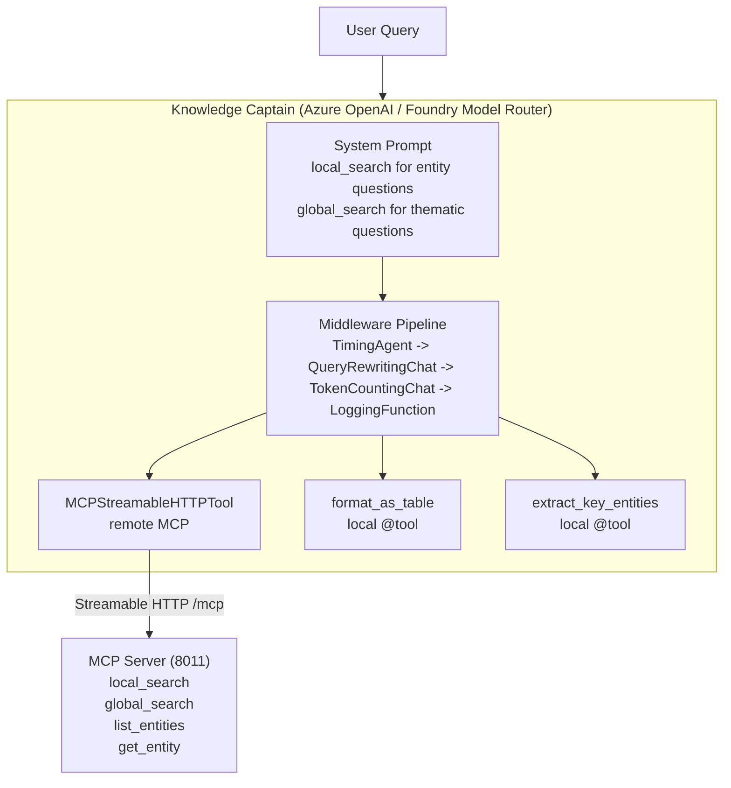

# Agents Module — Knowledge Captain

Supervisor Agent pattern built on Microsoft Agent Framework with GraphRAG tooling over MCP.

## Overview

The module provides the **Knowledge Captain**, a supervisor agent that talks to the GraphRAG MCP server. It runs exclusively on **Azure OpenAI / Foundry Model Router** deployments and relies on a system prompt to pick the right MCP tool for each query. Routing beyond that prompt lives in the workflow layer; this agent stays focused on fetching high-quality context.

**Features:**

- Foundry-only configuration (Azure OpenAI endpoint, router metadata capture)
- System prompt-controlled tool selection (no embedded code router)
- Lightweight observability middleware (timing, token counting, query rewriting, logging)
- Local `@tool` helpers for formatting or extraction without leaving the process
- Research delegate sub-agent for context-isolated deep dives
- Conversation memory for follow-up questions across a session
- Single MCP connection managed as an async context manager

## Architecture



## Key Insight: System Prompt as Router

The agent doesn't need complex routing logic. The system prompt tells GPT-4o when to use each tool:

| Question Type  | Tool Selected   | Example                     |
| -------------- | --------------- | --------------------------- |
| Entity-focused | `local_search`  | "Who leads Project Alpha?"  |
| Thematic       | `global_search` | "What are the main themes?" |
| Browse         | `list_entities` | "What entities exist?"      |
| Details        | `get_entity`    | "Tell me about David Kumar" |

## Module Structure

```
agents/
├── __init__.py      # Re-exports (all public API)
├── config.py        # Foundry-only configuration, router metadata helpers
├── middleware.py    # Three-layer observability middleware pipeline
├── prompts.py       # System prompts (Knowledge Captain, Research Delegate)
├── router_classifier.py # Router classifier used by RouterWorkflow
├── supervisor.py    # Knowledge Captain agent, runner, research delegate, MCP tool
├── tools.py         # Local @tool functions (format_as_table, extract_key_entities)
└── README.md        # This file
```

## Quick Start

### Prerequisites

1. MCP Server running: `uv run python run_mcp_server.py`
2. Knowledge graph built: `uv run python -m core.index`
3. Azure OpenAI configured in `.env`

### Environment Variables

```bash
# Required (Azure OpenAI / Foundry)
AZURE_OPENAI_ENDPOINT=https://your-resource.openai.azure.com/
AZURE_OPENAI_API_KEY=your-api-key
AZURE_OPENAI_CHAT_DEPLOYMENT=gpt-4o
AZURE_OPENAI_ROUTER_DEPLOYMENT=router-deployment-name

# Optional
AZURE_OPENAI_API_VERSION=2024-11-20
AZURE_OPENAI_ROUTER_ENDPOINT=https://your-router-resource.openai.azure.com/
AZURE_OPENAI_ROUTER_SUBSET=default
MCP_SERVER_URL=http://127.0.0.1:8011/mcp
```

### Running the Agent

```bash
# Interactive CLI mode
uv run python run_agent.py

# Single query
uv run python run_agent.py "Who leads Project Alpha?"
```

### CLI Commands

| Command         | Description                |
| --------------- | -------------------------- |
| `clear`         | Clear conversation history |
| `quit` / `exit` | Exit the chat              |

## Usage

### Using KnowledgeCaptainRunner (Recommended)

```python
from agents import KnowledgeCaptainRunner

async with KnowledgeCaptainRunner() as runner:
    # Ask questions
    response = await runner.ask("Who leads Project Alpha?")
    print(response.text)

    # Follow-up questions have context (conversation memory)
    response2 = await runner.ask("What about Project Beta?")
    print(response2.text)

    # Clear history to start fresh
    runner.clear_history()
```

### Manual Setup

```python
from agents import create_knowledge_captain

# Agent as async context manager (rc5+) — auto-manages MCP tool lifecycle
agent = create_knowledge_captain()

async with agent:
    result = await agent.run("Who leads Project Alpha?")
    print(result.text)
```

### Custom System Prompt

```python
from agents import KnowledgeCaptainRunner, SIMPLE_ASSISTANT_PROMPT

# Use simpler prompt
async with KnowledgeCaptainRunner(system_prompt=SIMPLE_ASSISTANT_PROMPT) as runner:
    response = await runner.ask("What technologies are used?")
```

## Foundry Model Router Configuration

The Knowledge Captain is locked to Azure OpenAI deployments managed by the Foundry Model Router. `AgentConfig`
expects these environment variables:

| Variable                         | Purpose                                                        |
| -------------------------------- | -------------------------------------------------------------- |
| `AZURE_OPENAI_ENDPOINT`          | Base endpoint URL (for example `https://foo.openai.azure.com`) |
| `AZURE_OPENAI_CHAT_DEPLOYMENT`   | Default chat deployment used by the supervisor agent           |
| `AZURE_OPENAI_ROUTER_DEPLOYMENT` | Router deployment dedicated to the workflow classifier         |
| `AZURE_OPENAI_ROUTER_SUBSET`     | Optional comma-separated subset label                          |

```python
import os

os.environ["AZURE_OPENAI_ENDPOINT"] = "https://myproj.eastus2.openai.azure.com"
os.environ["AZURE_OPENAI_CHAT_DEPLOYMENT"] = "knowledge-captain"
os.environ["AZURE_OPENAI_ROUTER_DEPLOYMENT"] = "router-production"
os.environ["AZURE_OPENAI_ROUTER_SUBSET"] = "fallback-a"

from agents import create_client

client = create_client()  # Targets the Foundry deployment above
```

## Middleware Pipeline

The agent supports a three-layer middleware pipeline for observability and context management:

| Layer        | Middleware Class               | Purpose                                   |
| ------------ | ------------------------------ | ----------------------------------------- |
| **Agent**    | `TimingAgentMiddleware`        | Measures total agent execution time       |
| **Chat**     | `QueryRewritingChatMiddleware` | Rewrites vague queries for better results |
| **Chat**     | `TokenCountingChatMiddleware`  | Tracks prompt/completion token usage      |
| **Function** | `LoggingFunctionMiddleware`    | Logs MCP tool calls with arguments        |

Default stack (injected automatically): `TimingAgentMiddleware` → `QueryRewritingChatMiddleware` → `TokenCountingChatMiddleware` → `LoggingFunctionMiddleware`.

```python
from agents import KnowledgeCaptainRunner, QueryRewritingChatMiddleware
from agents.middleware import TimingAgentMiddleware, TokenCountingChatMiddleware, LoggingFunctionMiddleware

# Custom middleware stack with query rewriting
runner = KnowledgeCaptainRunner(middleware=[
    TimingAgentMiddleware(),
    TokenCountingChatMiddleware(),
    QueryRewritingChatMiddleware(),
    LoggingFunctionMiddleware(),
])
```

## Local Tool Functions

Lightweight `@tool`-decorated functions that run locally (no MCP round-trip):

| Tool                   | Purpose                                     |
| ---------------------- | ------------------------------------------- |
| `format_as_table`      | Format a list of dicts as a Markdown table  |
| `extract_key_entities` | Extract entity names from unstructured text |

```python
from agents import create_knowledge_captain, format_as_table, extract_key_entities

# Add local tools alongside the MCP tool
agent = create_knowledge_captain(
    local_tools=[format_as_table, extract_key_entities],
)
async with agent:
    result = await agent.run("List the projects in a table")
```

## Research Delegate (Context Isolation)

A `@tool`-decorated function wrapping a research sub-agent with its own MCP session:

```python
from agents import create_research_delegate

# Create a delegate tool
delegate = create_research_delegate()

# Use as a tool in a supervisor agent
from agents import create_knowledge_captain
agent = create_knowledge_captain(local_tools=[delegate])
async with agent:
    result = await agent.run("Deep dive on Project Alpha's technology decisions")
```

The delegate provides **context isolation**: its internal conversation (raw MCP payloads) never leaks into the coordinator's context. The coordinator only sees a concise summary.

## MCP Transport Protocol

This module uses the **Streamable HTTP** transport (`/mcp` endpoint) instead of SSE (`/sse`):

| Transport           | Endpoint | Use Case                                            |
| ------------------- | -------- | --------------------------------------------------- |
| **Streamable HTTP** | `/mcp`   | Microsoft Agent Framework (`MCPStreamableHTTPTool`) |
| **SSE**             | `/sse`   | MCP Inspector, browser-based clients                |

**Why Streamable HTTP?**

- Required by `MCPStreamableHTTPTool` from Agent Framework
- Bidirectional communication (client can send multiple requests)
- Better suited for agent-to-server interaction
- SSE is unidirectional (server-push only), designed for browser clients

The MCP Server exposes both endpoints, but agents always connect via `/mcp`.

## Router Metadata Hand-off

`AgentConfig` captures Foundry router metadata (mode, subset) so downstream workflows can log or audit how production traffic is partitioned. The agent exposes this metadata through `create_client()` and `KnowledgeCaptainRunner`, enabling the router workflow to embed it in each `WorkflowResult` step.

## Architecture Benefits

- **Foundry-only** — Configuration and validation assume Azure OpenAI deployments and Foundry router usage
- **Agent owns its MCP tool** — `async with agent:` connects on enter, closes on exit
- **Single source of truth** — All GraphRAG tools live in `mcp_server/`
- **System prompt routing** — GPT-4o decides which tool to call (no code router)
- **Middleware pipeline** — Pluggable observability (timing, tokens, logging, optional rewriting)
- **Local + remote tools** — `@tool` functions complement MCP tools without round-trips
- **Context isolation** — Research delegate encapsulates sub-agent conversations

## References

- [Microsoft Agent Framework Documentation](https://learn.microsoft.com/agent-framework/)
- [MCP Protocol Specification](https://modelcontextprotocol.io/)
- [GraphRAG Documentation](https://microsoft.github.io/graphrag/)
