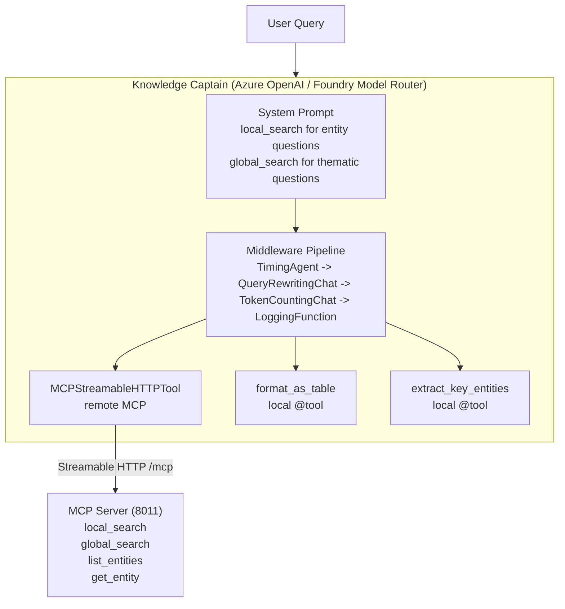

# Agents Module

Session store, router classifier, observability middleware, and supervisor utilities for the MAF + GraphRAG router-first architecture.

## Overview

The module provides three distinct capabilities that support the `RouterWorkflow` production entry point:

1. **Session store** — process-local `InMemorySessionStore` for multi-turn conversational state, TTL expiration, bounded capacity, and checkpoint/resume tracking.
2. **Router classifier** — Foundry-backed `RouterClassifier` used by `RouterWorkflow` to classify queries and select the appropriate sub-workflow.
3. **Supervisor utilities** — `create_client`, `create_mcp_tool`, and `create_research_delegate` for wiring agents to Azure OpenAI and the GraphRAG MCP server.

The Knowledge Captain conversational agent that was introduced in Part 3 was superseded by the router-first workflow architecture in Part 6 and removed in Part 7. All conversational routing now goes through `RouterWorkflow`.

## Module Structure

```
agents/
├── __init__.py          # Public API exports
├── config.py            # AgentConfig + SessionConfig (validated from env)
├── middleware.py        # Four-layer observability middleware pipeline
├── prompts.py           # System prompts used by supervisor agents
├── router_classifier.py # RouterClassifier used by RouterWorkflow
├── session_store.py     # InMemorySessionStore with TTL, LRU, checkpoint tracking
├── supervisor.py        # create_client, create_mcp_tool, create_research_delegate
├── tools.py             # Local @tool functions (format_as_table, extract_key_entities)
└── README.md            # This file
```

## Session Store

`InMemorySessionStore` extends `agent_framework.SessionStore` with production-ready TTL expiration, bounded LRU capacity, opportunistic cleanup, and process-local checkpoint/resume tracking for multi-turn conversations.

### Key types

| Type                           | Purpose                                                                          |
| ------------------------------ | -------------------------------------------------------------------------------- |
| `SessionKey`                   | Normalized channel + conversation + user → deterministic SHA256 `session_id`     |
| `SessionRecord`                | Mutable session state: history groups, turn index, per-session lock, diagnostics |
| `ActiveWorkflowRun`            | Process-local checkpoint correlation for interrupted workflow runs               |
| `InMemorySessionStore`         | TTL + LRU eviction + cleanup + metrics; subclasses native `SessionStore`         |
| `SessionCompactionDiagnostics` | Structured output from history sliding-window compaction                         |
| `SessionStoreMetrics`          | Counters: `active_sessions`, `evictions`, `ttl_expirations`, `cleanup_runs`      |

```python
from agents.session_store import InMemorySessionStore, SessionKey

store = InMemorySessionStore(
    ttl_seconds=1800,
    max_count=1000,
    cleanup_interval_seconds=60,
    max_history_groups=12,
)

key = SessionKey.create(channel_id="msteams", conversation_id="conv-1", user_id="user-1")
record, created = await store.get_or_create(key.session_id)

# Append a completed turn (updates history and triggers compaction if needed)
diagnostics = store.append_turn(record, user_text="Hello", assistant_text="Hi!")
```

### Checkpoint/resume tracking

`SessionRecord.active_workflow_run` holds an optional `ActiveWorkflowRun` that correlates the session with a native framework checkpoint after a workflow timeout or interruption:

```python
from agents.session_store import ActiveWorkflowRun

# Set by RouterChatService._save_checkpoint_after_interruption() on timeout
record.active_workflow_run = ActiveWorkflowRun(
    workflow_run_id="run-uuid",
    checkpoint_id="framework-checkpoint-uuid",
    workflow_type="sequential",   # used to validate compatibility on resume
)
```

On the next request, `RouterChatService._resolve_resume_checkpoint()` validates the checkpoint (exists + correct workflow type) and passes `checkpoint_id` to `Workflow.run()`.

### Configuration

Session defaults are sourced from environment variables via `SessionConfig`:

| Variable                           | Default | Description                   |
| ---------------------------------- | ------- | ----------------------------- |
| `SESSION_TTL_SECONDS`              | 1800    | Session expiration time       |
| `SESSION_MAX_COUNT`                | 1000    | Maximum active sessions       |
| `SESSION_CLEANUP_INTERVAL_SECONDS` | 60      | Cleanup cadence               |
| `SESSION_MAX_HISTORY_GROUPS`       | 12      | Sliding window turns retained |

## Router Classifier

`RouterClassifier` is called by `RouterWorkflow` to classify a query and select a sub-workflow. It uses an `OpenAIChatCompletionClient` pointed at the Foundry model-router deployment.

```python
from agents.router_classifier import RouterClassifier
from agents.config import AgentConfig

config = AgentConfig.from_env()
classifier = RouterClassifier(config)
classification = await classifier.classify("Who leads Project Alpha?")
# classification.workflow_label → "sequential" | "concurrent" | "handoff" | "out_of_context"
# classification.confidence_score → 0-100
```

Configuration variables:

| Variable                         | Description                                     |
| -------------------------------- | ----------------------------------------------- |
| `AZURE_OPENAI_ROUTER_DEPLOYMENT` | Foundry model-router deployment name            |
| `AZURE_OPENAI_ROUTER_ENDPOINT`   | Optional separate endpoint for the router model |
| `AZURE_OPENAI_ROUTER_SUBSET`     | Optional comma-separated subset label           |

## Supervisor Utilities

Factory functions for creating Azure OpenAI clients, MCP tools, and research delegate agents:

```python
from agents.supervisor import create_client, create_mcp_tool, create_research_delegate

# Foundry OpenAI chat client
client = create_client()

# MCPStreamableHTTPTool connected to the GraphRAG MCP server
mcp_tool = create_mcp_tool(mcp_url="http://localhost:8011/mcp")

# Context-isolated research delegate agent
delegate = create_research_delegate()
```

### Research Delegate

`create_research_delegate()` returns a `@tool`-decorated function wrapping a sub-agent with its own MCP session. Useful as a tool in a supervisor agent when context isolation is needed — the delegate's raw MCP payloads never leak into the coordinator's context; only a concise summary is returned.

## Observability Middleware

A four-layer middleware pipeline for agent observability and context management:

| Layer    | Class                          | Purpose                                |
| -------- | ------------------------------ | -------------------------------------- |
| Agent    | `TimingAgentMiddleware`        | Measures total agent execution time    |
| Chat     | `QueryRewritingChatMiddleware` | Rewrites vague queries before LLM call |
| Chat     | `TokenCountingChatMiddleware`  | Tracks prompt/completion token usage   |
| Function | `LoggingFunctionMiddleware`    | Logs MCP tool calls with arguments     |

```python
from agents.middleware import (
    TimingAgentMiddleware,
    QueryRewritingChatMiddleware,
    TokenCountingChatMiddleware,
    LoggingFunctionMiddleware,
)
```

## Configuration

`AgentConfig` validates all Azure OpenAI settings from environment variables:

```python
from agents.config import AgentConfig, get_agent_config

config = AgentConfig.from_env()   # or get_agent_config() for a cached singleton
client = create_client(config)
```

Required environment variables:

| Variable                         | Description                                                            |
| -------------------------------- | ---------------------------------------------------------------------- |
| `AZURE_OPENAI_ENDPOINT`          | Azure OpenAI service base URL                                          |
| `AZURE_OPENAI_API_KEY`           | API key (or use `AZURE_CLIENT_ID`/`AZURE_TENANT_ID` for Entra ID auth) |
| `AZURE_OPENAI_CHAT_DEPLOYMENT`   | Default chat deployment (e.g. `gpt-4o`)                                |
| `AZURE_OPENAI_ROUTER_DEPLOYMENT` | Router deployment for the classifier                                   |

## Local Tool Functions

Lightweight `@tool`-decorated functions that run in-process (no MCP round-trip):

| Tool                   | Purpose                                      |
| ---------------------- | -------------------------------------------- |
| `format_as_table`      | Formats a list of dicts as a Markdown table  |
| `extract_key_entities` | Extracts entity names from unstructured text |

## References

- [Microsoft Agent Framework Documentation](https://learn.microsoft.com/agent-framework/)
- [MCP Protocol Specification](https://modelcontextprotocol.io/)
- [GraphRAG Documentation](https://microsoft.github.io/graphrag/)



## System Prompt Routing

The agent doesn't need complex routing logic. The system prompt tells GPT-4o when to use each tool:

| Question Type  | Tool Selected   | Example                     |
| -------------- | --------------- | --------------------------- |
| Entity-focused | `local_search`  | "Who leads Project Alpha?"  |
| Thematic       | `global_search` | "What are the main themes?" |
| Browse         | `list_entities` | "What entities exist?"      |
| Details        | `get_entity`    | "Tell me about David Kumar" |

## Module Structure

```
agents/
├── __init__.py      # Re-exports (all public API)
├── config.py        # Foundry-only configuration, router metadata helpers
├── middleware.py    # Three-layer observability middleware pipeline
├── prompts.py       # System prompts (Knowledge Captain, Research Delegate)
├── router_classifier.py # Router classifier used by RouterWorkflow
├── supervisor.py    # Knowledge Captain agent, runner, research delegate, MCP tool
├── tools.py         # Local @tool functions (format_as_table, extract_key_entities)
└── README.md        # This file
```

## Quick Start

### Prerequisites

1. MCP Server running: `uv run python run_mcp_server.py`
2. Knowledge graph built: `uv run python -m maf_graphrag.core.index`
3. Azure OpenAI configured in `.env`

### Environment Variables

```bash
# Required (Azure OpenAI / Foundry)
AZURE_OPENAI_ENDPOINT=https://your-resource.openai.azure.com/
AZURE_OPENAI_API_KEY=your-api-key
AZURE_OPENAI_CHAT_DEPLOYMENT=gpt-4o
AZURE_OPENAI_ROUTER_DEPLOYMENT=router-deployment-name

# Optional
AZURE_OPENAI_API_VERSION=your-supported-api-version
AZURE_OPENAI_ROUTER_ENDPOINT=https://your-router-resource.openai.azure.com/
AZURE_OPENAI_ROUTER_SUBSET=default
MCP_SERVER_URL=http://127.0.0.1:8011/mcp
```

### Running the Agent Surface

```bash
# Interactive surface (DevUI)
uv run python run_devui.py
```

For direct programmatic usage (without DevUI), use `KnowledgeCaptainRunner` as shown below.

## Usage

### Using KnowledgeCaptainRunner

```python
from maf_graphrag.agents import KnowledgeCaptainRunner

async with KnowledgeCaptainRunner() as runner:
    # Ask questions
    response = await runner.ask("Who leads Project Alpha?")
    print(response.text)

    # Follow-up questions have context (conversation memory)
    response2 = await runner.ask("What about Project Beta?")
    print(response2.text)

    # Clear history to start fresh
    runner.clear_history()
```

### Manual Setup

```python
from maf_graphrag.agents import create_knowledge_captain

# Agent as async context manager — auto-manages MCP tool lifecycle
agent = create_knowledge_captain()

async with agent:
    result = await agent.run("Who leads Project Alpha?")
    print(result.text)
```

### Custom System Prompt

```python
from maf_graphrag.agents import KnowledgeCaptainRunner, SIMPLE_ASSISTANT_PROMPT

# Use simpler prompt
async with KnowledgeCaptainRunner(system_prompt=SIMPLE_ASSISTANT_PROMPT) as runner:
    response = await runner.ask("What technologies are used?")
```

## Foundry Model Router Configuration

The Knowledge Captain is locked to Azure OpenAI deployments managed by the Foundry Model Router. `AgentConfig`
expects these environment variables:

| Variable                         | Purpose                                                        |
| -------------------------------- | -------------------------------------------------------------- |
| `AZURE_OPENAI_ENDPOINT`          | Base endpoint URL (for example `https://foo.openai.azure.com`) |
| `AZURE_OPENAI_CHAT_DEPLOYMENT`   | Default chat deployment used by the supervisor agent           |
| `AZURE_OPENAI_ROUTER_DEPLOYMENT` | Router deployment dedicated to the workflow classifier         |
| `AZURE_OPENAI_ROUTER_SUBSET`     | Optional comma-separated subset label                          |

```python
import os

os.environ["AZURE_OPENAI_ENDPOINT"] = "https://myproj.eastus2.openai.azure.com"
os.environ["AZURE_OPENAI_CHAT_DEPLOYMENT"] = "knowledge-captain"
os.environ["AZURE_OPENAI_ROUTER_DEPLOYMENT"] = "router-production"
os.environ["AZURE_OPENAI_ROUTER_SUBSET"] = "fallback-a"

from maf_graphrag.agents import create_client

client = create_client()  # Targets the Foundry deployment above
```

## Middleware Pipeline

The agent supports a three-layer middleware pipeline for observability and context management:

| Layer        | Middleware Class               | Purpose                                   |
| ------------ | ------------------------------ | ----------------------------------------- |
| **Agent**    | `TimingAgentMiddleware`        | Measures total agent execution time       |
| **Chat**     | `QueryRewritingChatMiddleware` | Rewrites vague queries for better results |
| **Chat**     | `TokenCountingChatMiddleware`  | Tracks prompt/completion token usage      |
| **Function** | `LoggingFunctionMiddleware`    | Logs MCP tool calls with arguments        |

Default stack (injected automatically): `TimingAgentMiddleware` → `QueryRewritingChatMiddleware` → `TokenCountingChatMiddleware` → `LoggingFunctionMiddleware`.

```python
from maf_graphrag.agents import KnowledgeCaptainRunner, QueryRewritingChatMiddleware
from agents.middleware import TimingAgentMiddleware, TokenCountingChatMiddleware, LoggingFunctionMiddleware

# Custom middleware stack with query rewriting
runner = KnowledgeCaptainRunner(middleware=[
    TimingAgentMiddleware(),
    TokenCountingChatMiddleware(),
    QueryRewritingChatMiddleware(),
    LoggingFunctionMiddleware(),
])
```

## Local Tool Functions

Lightweight `@tool`-decorated functions that run locally (no MCP round-trip):

| Tool                   | Purpose                                     |
| ---------------------- | ------------------------------------------- |
| `format_as_table`      | Format a list of dicts as a Markdown table  |
| `extract_key_entities` | Extract entity names from unstructured text |

```python
from maf_graphrag.agents import create_knowledge_captain, format_as_table, extract_key_entities

# Add local tools alongside the MCP tool
agent = create_knowledge_captain(
    local_tools=[format_as_table, extract_key_entities],
)
async with agent:
    result = await agent.run("List the projects in a table")
```

## Research Delegate (Context Isolation)

A `@tool`-decorated function wrapping a research sub-agent with its own MCP session:

```python
from maf_graphrag.agents import create_research_delegate

# Create a delegate tool
delegate = create_research_delegate()

# Use as a tool in a supervisor agent
from maf_graphrag.agents import create_knowledge_captain
agent = create_knowledge_captain(local_tools=[delegate])
async with agent:
    result = await agent.run("Deep dive on Project Alpha's technology decisions")
```

The delegate provides **context isolation**: its internal conversation (raw MCP payloads) never leaks into the coordinator's context. The coordinator only sees a concise summary.

## MCP Transport Protocol

This module uses the **Streamable HTTP** transport (`/mcp` endpoint) as the agent-facing MCP transport:

| Transport           | Endpoint | Use Case                                            |
| ------------------- | -------- | --------------------------------------------------- |
| **Streamable HTTP** | `/mcp`   | Microsoft Agent Framework (`MCPStreamableHTTPTool`) |
| **SSE**             | `/sse`   | MCP Inspector, browser-based clients                |

**Why Streamable HTTP?**

- Required by `MCPStreamableHTTPTool` from Agent Framework
- Bidirectional communication (client can send multiple requests)
- Better suited for agent-to-server interaction
- SSE is unidirectional (server-push only), designed for browser clients

The MCP Server exposes both endpoints, but agents always connect via `/mcp`.

## Router Metadata Hand-off

`AgentConfig` captures Foundry router metadata (mode, subset) so downstream workflows can log or audit how production traffic is partitioned. The agent exposes this metadata through `create_client()` and `KnowledgeCaptainRunner`, enabling the router workflow to embed it in each `WorkflowResult` step.

## Architecture Benefits

- **Foundry-only** — Configuration and validation assume Azure OpenAI deployments and Foundry router usage
- **Agent owns its MCP tool** — `async with agent:` connects on enter, closes on exit
- **Single source of truth** — All GraphRAG tools live in `mcp_server/`
- **System prompt routing** — GPT-4o decides which tool to call (no code router)
- **Middleware pipeline** — Pluggable observability (timing, tokens, logging, optional rewriting)
- **Local + remote tools** — `@tool` functions complement MCP tools without round-trips
- **Context isolation** — Research delegate encapsulates sub-agent conversations

## References

- [Microsoft Agent Framework Documentation](https://learn.microsoft.com/agent-framework/)
- [MCP Protocol Specification](https://modelcontextprotocol.io/)
- [GraphRAG Documentation](https://microsoft.github.io/graphrag/)
