# Part 5: Agent Evaluation — Monitoring, Evaluation & Safety

End-to-end evaluation pipeline for the router-first GraphRAG assistant using Microsoft Foundry
evaluators (via `agent_framework_foundry.FoundryEvals`), OpenTelemetry tracing, and optional red
team safety scanning.

### Quality Pillars

- **Monitoring**: OpenTelemetry instrumentation (local OTLP or Application Insights) keeps live agent runs observable.
- **Quality evaluation**: Foundry LLM-judge evaluators (`FoundryEvals`) plus custom GraphRAG entity and relationship validators measure grounded accuracy.
- **Safety evaluation**: Red-team flows probe deployments with Azure AI Foundry attack strategies to surface risky behaviors.

## Architecture

```mermaid
flowchart TD
    G["golden_questions.jsonl"] --> D["generate_eval_data.py\nrun agent and write eval_data.jsonl"]
    D --> E["eval_data.jsonl"]
    E --> B["run_batch_evaluation.py\nLLM-judge + custom evaluators"]
    B --> R1["results/evaluation_results.json"]
    B --> R2["results/evaluation_report.md"]

    B --> RE["relevance"]
    B --> CO["coherence"]
    B --> TA["task_adherence"]
    B --> TCA["tool_call_accuracy"]
    B --> TS["tool_selection"]
    B --> TIA["tool_input_accuracy"]
    B --> TOU["tool_output_utilization"]
    B --> TCS["tool_call_success"]
    B --> EA["EntityAccuracyEvaluator"]
    B --> RV["RelationshipValidityEvaluator"]

    E --> RT["run_redteam.py\noptional safety scan"]
    RT --> R3["results/redteam_results.json"]
```



## Prerequisites

- Knowledge graph already indexed (`uv run python -m maf_graphrag.core.index`)
- MCP server running on `localhost:8011`
- Azure OpenAI credentials in `.env`

## Environment Variables

### Required (all scripts)

| Variable                       | Description                              |
| ------------------------------ | ---------------------------------------- |
| `AZURE_OPENAI_ENDPOINT`        | Azure OpenAI service endpoint            |
| `AZURE_OPENAI_API_KEY`         | Azure OpenAI API key                     |
| `AZURE_OPENAI_CHAT_DEPLOYMENT` | Chat deployment name (default: `gpt-4o`) |

### Optional (evaluation model override)

| Variable                            | Description                                                                                         |
| ----------------------------------- | --------------------------------------------------------------------------------------------------- |
| `AZURE_OPENAI_EVAL_CHAT_DEPLOYMENT` | Deployment used only by Step 3 evaluators. Defaults to `AZURE_OPENAI_CHAT_DEPLOYMENT` when omitted. |

### Optional (Foundry dashboard + red teaming)

| Variable           | Description                                                                            |
| ------------------ | -------------------------------------------------------------------------------------- |
| `AZURE_AI_PROJECT` | Foundry project URL (`https://<account>.services.ai.azure.com/api/projects/<project>`) |

Step 4 requires `AZURE_AI_PROJECT` and uses the Foundry project endpoint path.

### Required in GitHub Actions for Foundry publish and red-team

When Step 3 (default Foundry publish; not used when `--local` is passed) and Step 4 run in CI, `DefaultAzureCredential` must resolve
to a service principal. Configure these repository secrets:

| Secret                | Description                                         |
| --------------------- | --------------------------------------------------- |
| `AZURE_TENANT_ID`     | Microsoft Entra tenant ID for the service principal |
| `AZURE_CLIENT_ID`     | Service principal application (client) ID           |
| `AZURE_CLIENT_SECRET` | Service principal client secret                     |

Also keep `AZURE_AI_PROJECT` configured, and ensure this service principal has permission
to create/read evaluation runs in the target Foundry project.

### Optional (Application Insights monitoring)

| Variable                                | Description                                                                |
| --------------------------------------- | -------------------------------------------------------------------------- |
| `APPLICATIONINSIGHTS_CONNECTION_STRING` | App Insights connection string for production traces                       |
| `OTEL_TRACING_ENDPOINT`                 | OTLP endpoint for local tracing backend (default: `http://localhost:4317`) |
| `ENABLE_SENSITIVE_DATA`                 | Include raw prompts and responses in telemetry spans (set to `true`/`1`)   |

### Optional (custom evaluators)

| Variable                     | Description                   | Default                                     |
| ---------------------------- | ----------------------------- | ------------------------------------------- |
| `ENTITIES_PARQUET_PATH`      | Path to entities Parquet      | `output/create_final_entities.parquet`      |
| `RELATIONSHIPS_PARQUET_PATH` | Path to relationships Parquet | `output/create_final_relationships.parquet` |

## Evaluation Workflow

### Region Strategy (Single Project)

Use one Foundry project in a region that supports the features you need most.

- Step 3 (batch evaluation) and Step 4 (red teaming) can use the same project.
- For best coverage, prefer a region documented for evaluation + red teaming support (for example `East US 2` or `France Central`).
- If your selected region lacks required safety capabilities, move the project to a supported region.

### Step 1 — Start the MCP server (terminal 1)

```powershell
uv run python run_mcp_server.py
```

### Step 2 — Generate evaluation data (terminal 2)

Runs the router workflow against each of the 10 golden questions and writes
`src/maf_graphrag/evaluation/datasets/eval_data.jsonl`:

Step 2 is independent from Foundry publishing. If you already have `eval_data.jsonl`, you can reuse it directly.

```powershell
uv run python -m maf_graphrag.evaluation.scripts.generate_eval_data
```

Router-focused variant (includes `out_of_context` routing checks and writes `eval_router_data.jsonl`):

```powershell
uv run python -m maf_graphrag.evaluation.scripts.generate_router_eval_data
```

Router dataset rule for edge cases:

- `expected_routed_workflow` remains the coarse label used in reports (`in_context` / `out_of_context`).
- `accepted_routed_workflows` can list multiple valid concrete routes for a prompt (for example `handoff` and `sequential`).
- `route_match` is computed against that accepted set, so ambiguity does not create false negatives.

### When you must regenerate `eval_data.jsonl` / `eval_router_data.jsonl`

Step 2 is the **only** step that talks to the live MCP server and the router workflow. Step 3
(batch evaluation) never calls the MCP server again — it scores whatever conversation/response
is already stored in the JSONL file. This means a stale dataset silently keeps evaluating
_old_ tool behavior even after the code changes. Regenerate before evaluating whenever you change:

- MCP tool schemas — `src/maf_graphrag/mcp_server/tools/**` (name, description, or parameters
  of `search_knowledge_graph`, `local_search`, `global_search`, `list_entities`, `get_entity`).
- Prompts — `prompts/**` (community reports, search system prompts, extraction prompts).
- GraphRAG indexing/search config — `settings.yaml`.
- Router/agent/workflow logic that changes what gets said or which tools get called —
  `src/maf_graphrag/agents/**`, `src/maf_graphrag/workflows/**`.

CI enforces this automatically for the router dataset: `router-pr-merge-gate.yml` and
`router-main-evaluation.yml` always pass `regenerate_data: true` when they decide to run at all,
and their change-detection step is deny-list based (skips only for provably doc-only changes),
so a PR touching any of the paths above will regenerate `eval_router_data.jsonl` against a live
MCP server + router run before scoring it — see
[.github/workflows/README.md](../../../.github/workflows/README.md#what-can-skip-evaluation).

Output:

```
Processed 10/10 test cases
Evaluation data written to src/maf_graphrag/evaluation/datasets/eval_data.jsonl
```

### Step 3 — Run batch evaluation

Publishes to Azure AI Foundry through `agent_framework_foundry.FoundryEvals`, which resolves
evaluator names against Foundry's `builtin.*` registry and runs them as an LLM-judge cloud
evaluation. `run_batch_evaluation.py` requests the full evaluator set explicitly
(`relevance`, `coherence`, `task_adherence`, `tool_call_accuracy`, `tool_selection`,
`tool_input_accuracy`, `tool_output_utilization`, `tool_call_success`); `FoundryEvals` still
drops the tool evaluators automatically for rows without `tool_definitions`. The two custom
graph evaluators (`EntityAccuracyEvaluator`, `RelationshipValidityEvaluator`) run locally
against the Parquet outputs and are merged into the same result file.

> Tool evaluators (`tool_call_accuracy`, `tool_selection`, `tool_input_accuracy`,
> `tool_output_utilization`, `tool_call_success`) require tool-call content typed with the
> OpenAI/Foundry vocabulary (`type: "tool_call"` / `"tool_result"`, with `tool_call_id` on the
> `tool` message) — **not** Agent Framework's own internal `function_call`/`function_result`
> content types. `Content.from_dict` accepts any `type` string without validating it, so a
> mismatch here fails silently until Foundry's cloud-side validator rejects the missing
> `tool_call_id`. See [Evaluators Reference](#evaluators-reference) below for the official
> references and how `_normalize_message_payload` bridges the two vocabularies.

Larger evaluator sets need more local poll time: `FoundryEvals` defaults to a 180s poll
timeout, but `run_batch_evaluation.py` raises it to 600s since LLM-judge work scales with
`evaluator_count × item_count`. A `status="timeout"` result does not mean the Foundry run
failed — check the run in the portal (or via `client.evals.runs.retrieve(...)`) before
assuming failure.

`--local` skips Foundry entirely and scores items with Agent Framework's own native
`LocalEvaluator` (`tool_calls_present`, `tool_call_args_match`) — zero Azure/network calls,
used by the CI PR merge gate to keep pre-merge checks free. Signal is limited to tool-call
correctness (vacuously passing for rows without `expected_tool_calls`); use the default
Foundry path for quality/safety signal.

```powershell
# Standard evaluation (results saved locally)
uv run python -m maf_graphrag.evaluation.scripts.run_batch_evaluation

# Router-focused dataset evaluation
uv run python -m maf_graphrag.evaluation.scripts.run_batch_evaluation --data eval_router_data.jsonl

# Skip custom graph evaluators (no Parquet needed)
uv run python -m maf_graphrag.evaluation.scripts.run_batch_evaluation --no-custom

# Local-only evaluation (no Foundry/Azure calls)
uv run python -m maf_graphrag.evaluation.scripts.run_batch_evaluation --local
```

Results are written to:

- `src/maf_graphrag/evaluation/results/evaluation_results.json` — raw SDK output
- `src/maf_graphrag/evaluation/results/evaluation_report.md` — human-readable Markdown summary

Unless `--local` is passed, every run publishes to Foundry through the `openai/v1/evals`-compatible
API and writes the returned `report_url` into the local report (`studio_url` field).

Evaluation outputs vary by dataset and deployment, but local artifacts always preserve per-run metrics, token usage, and any Foundry-linked report URLs.

- Tool evaluators are dropped automatically for rows without `tool_definitions`; no manual conditional logic is needed.
- Custom graph evaluators remain available in local artifacts (`evaluation_results.json`, `evaluation_report.md`).

### Step 4 — (Optional) Red team safety scan

Requires an Azure AI Foundry project. **You do not need to redeploy your OpenAI models** — the Foundry
project is only used to submit the red team job and store results. LLM calls still go to your existing
`AZURE_OPENAI_ENDPOINT`.

Step 4 supports two flows:

- `cloud-model` (default, recommended): scans your Azure OpenAI deployment directly.
- `local-agent`: scans the local router workflow callback target.

Use `cloud-model` for the most stable Foundry-compatible path.

**Provision via Terraform** (adds a Foundry project under AI Services):

```hcl
# infra/terraform.tfvars
enable_foundry = true
```

```powershell
cd infra
terraform apply
terraform output -raw env_file_content > ../.env  # adds AZURE_AI_PROJECT automatically
```

```powershell
# Default flow: cloud-model, Baseline + EASY strategies, all 4 risk categories
uv run python -m maf_graphrag.evaluation.scripts.run_redteam

# Explicit cloud flow
uv run python -m maf_graphrag.evaluation.scripts.run_redteam --flow cloud-model

# Local callback flow (requires MCP server running)
uv run python -m maf_graphrag.evaluation.scripts.run_redteam --flow local-agent

# Custom strategies
uv run python -m maf_graphrag.evaluation.scripts.run_redteam --flow cloud-model --strategies baseline jailbreak crescendo

# Custom risk categories
uv run python -m maf_graphrag.evaluation.scripts.run_redteam --flow cloud-model --risks Violence HateUnfairness
```

Optional environment override:

```powershell
$env:REDTEAM_FLOW = "cloud-model"  # or local-agent
```

Available attack strategies: `baseline`, `jailbreak`, `crescendo`, `easy`, `moderate`, `difficult`, `multiturn`

Available risk categories: `Violence`, `HateUnfairness`, `Sexual`, `SelfHarm`

Results are written to `src/maf_graphrag/evaluation/results/redteam_results.json`.

In `cloud-model` flow, Step 4 also attempts a Foundry `openai/v1/evals` red-team
reference run and stores its metadata under `new_foundry` in the JSON output. This keeps
the full SDK red-team scorecard while providing a Foundry report URL.

Important behavior: if the scan completes but yields zero evaluated attacks (`0/0`), the script exits with
an explicit error. In practice, this usually indicates your selected region does not support required RAI
safety scoring capabilities (for example content-harm scoring). Keep a single project architecture, but place
that project in a region that supports Step 4 red teaming.

## Suggested Screenshots for Documentation

Use these Foundry views when documenting Part 5 outcomes:

| Screenshot                                                                             | Include in        | Why it is useful                                                                                                                              |
| -------------------------------------------------------------------------------------- | ----------------- | --------------------------------------------------------------------------------------------------------------------------------------------- |
| Batch run details (`graphrag-batch-...-run`) with overall metrics and detailed rows    | Evaluation README | Shows quality/tool results (`relevance`, `coherence`, `task_adherence`, `tool_call_accuracy`, `tool_selection`) and token usage in one place. |
| Red team run details (`graphrag-redteam-...-run`) with ASR metrics and attack outcomes | Evaluation README | Shows safety metrics by risk category and attack strategy.                                                                                    |
| Evaluations list page and Red team list page                                           | Root README       | Gives a quick project-level proof that both quality and safety workflows run successfully.                                                    |

Avoid using reduced-detail run pages that only show token counts, they do not communicate evaluation quality.

## Monitoring with OpenTelemetry

MAF agents automatically emit `gen_ai.*` spans for LLM calls, tool invocations, and agent steps.
Use `setup_monitoring()` from `evaluation.monitoring.otel_setup` before running agents.

### Local development

Set `OTEL_TRACING_ENDPOINT` to any local OTLP-compatible backend. Then in your code:

```python
from maf_graphrag.evaluation.monitoring.otel_setup import setup_monitoring
setup_monitoring()  # sends OTLP to OTEL_TRACING_ENDPOINT
```

### Production — Application Insights

Set `APPLICATIONINSIGHTS_CONNECTION_STRING` in your environment and call:

```python
from maf_graphrag.evaluation.monitoring.otel_setup import setup_monitoring
from maf_graphrag.evaluation.config import EvalConfig

config = EvalConfig.from_env()
setup_monitoring(config)
```

Set `ENABLE_SENSITIVE_DATA=true` (or `1`) before calling `setup_monitoring` if you need spans to include raw prompts and responses. Enable this switch only in secure environments because it copies user input and agent output into telemetry payloads.

Application Insights is provisioned automatically when you run `terraform apply` from `infra/`.
The connection string is exported as `application_insights_connection_string` and included in
the `.env` file generated by `terraform output -raw env_file_content > ../.env`.

## Evaluators Reference

### Foundry agent/quality evaluators (LLM-judge, run via `agent_framework_foundry.FoundryEvals`)

| Evaluator                 | What it measures                                     | Output                |
| ------------------------- | ---------------------------------------------------- | --------------------- |
| `relevance`               | Is the response relevant to the query?               | 1–5 scale             |
| `coherence`               | Is the response logically consistent?                | 1–5 scale             |
| `task_adherence`          | Did the agent follow its assigned task?              | Pass/Fail (1–5 scale) |
| `tool_call_accuracy`      | Were the right tools called with correct parameters? | Pass/Fail (1–5 scale) |
| `tool_selection`          | Did the agent choose the correct, necessary tools?   | Pass/Fail             |
| `tool_input_accuracy`     | Are tool call parameters strictly correct?           | Pass/Fail             |
| `tool_output_utilization` | Did the agent correctly use tool call results?       | Pass/Fail             |
| `tool_call_success`       | Did tool calls succeed without technical errors?     | Pass/Fail             |

Tool evaluators (`tool_call_accuracy`, `tool_selection`, `tool_input_accuracy`,
`tool_output_utilization`, `tool_call_success`) are dropped automatically by `FoundryEvals`
for rows without `tool_definitions` — no manual filtering is needed in this repo's code.
Each requires `query`/`response` conversation arrays (or the alternate `query`/`tool_calls`
shape) plus `tool_definitions`; see the [Agent evaluators](https://learn.microsoft.com/en-us/azure/foundry/concepts/evaluation-evaluators/agent-evaluators)
"Using agent evaluators" table for the exact required-inputs matrix per evaluator.

#### Tool-call content-type vocabulary (read this before adding a new tool evaluator)

Foundry's evaluation dataset schema represents tool calls as
`{"role": "assistant", "content": [{"type": "tool_call", "tool_call_id": ..., "name": ..., "arguments": {...}}]}`
followed by `{"role": "tool", "tool_call_id": ..., "content": [{"type": "tool_result", "tool_result": {...}}]}`.
Agent Framework's own `Content` model instead uses `type: "function_call"` / `"function_result"`
internally. `Content.from_dict` accepts any `type` string without validating it, so loading
Foundry-vocabulary JSONL straight into `Message.from_dict(...)` produces content that
`AgentEvalConverter.convert_messages` silently fails to recognize — the resulting message loses
its `tool_call_id` entirely, and Foundry's cloud-side validator rejects it with
`Each content items for role 'tool' must contain a 'tool_call_id' field`. `_normalize_message_payload`
in `scripts/run_batch_evaluation.py` bridges this by aliasing `tool_call`/`tool_result` to
`function_call`/`function_result` before constructing `Message` objects. Official references:

- [Agent evaluators — Microsoft Foundry](https://learn.microsoft.com/en-us/azure/foundry/concepts/evaluation-evaluators/agent-evaluators)
- [Evaluation dataset schema — Microsoft Foundry](https://learn.microsoft.com/en-us/azure/foundry/observability/how-to/evaluation-dataset-schema)
- [Run evaluations from the SDK (cloud evaluation)](https://learn.microsoft.com/en-us/azure/foundry/observability/how-to/cloud-evaluation?tabs=python)
- [azure-sdk-for-python agentic_evaluators samples](https://github.com/Azure/azure-sdk-for-python/tree/main/sdk/ai/azure-ai-projects/samples/evaluations/agentic_evaluators)

### Custom (graph-based, no LLM)

| Evaluator                       | What it measures                                                                   | Output    |
| ------------------------------- | ---------------------------------------------------------------------------------- | --------- |
| `EntityAccuracyEvaluator`       | How many named entities in the response exist in the knowledge graph?              | 0–1 score |
| `RelationshipValidityEvaluator` | How many entity co-occurrences in the response reflect actual graph relationships? | 0–1 score |

## Module Structure

```
src/maf_graphrag/evaluation/
├── config.py                   # EvalConfig dataclass (from_env())
├── datasets/
│   ├── golden_questions.jsonl        # 10 hand-crafted test cases for TechVenture KB
│   ├── golden_router_questions.jsonl # Router-focused test cases (incl. out_of_context)
│   ├── eval_data.jsonl               # Generated by generate_eval_data.py (gitignored)
│   └── eval_router_data.jsonl        # Generated by generate_router_eval_data.py (gitignored)
├── evaluators/
│   ├── builtin.py              # GRAPHRAG_TOOL_DEFINITIONS for Foundry tool-aware evaluators
│   ├── _shared.py              # Shared helpers for custom graph evaluators
│   ├── entity_accuracy.py      # Custom: entity existence in graph Parquet
│   └── relationship_validity.py# Custom: relationship existence in graph Parquet
├── monitoring/
│   └── otel_setup.py           # OpenTelemetry setup (OTLP + App Insights)
├── results/                    # Created at runtime (gitignored)
└── scripts/
    ├── generate_eval_data.py        # Step 2: run agent → eval_data.jsonl
    ├── generate_router_eval_data.py # Step 2 (router variant): → eval_router_data.jsonl
    ├── run_batch_evaluation.py      # Step 3: batch evaluate via FoundryEvals/LocalEvaluator
    └── run_redteam.py               # Step 4: safety scan (Foundry required)
```
