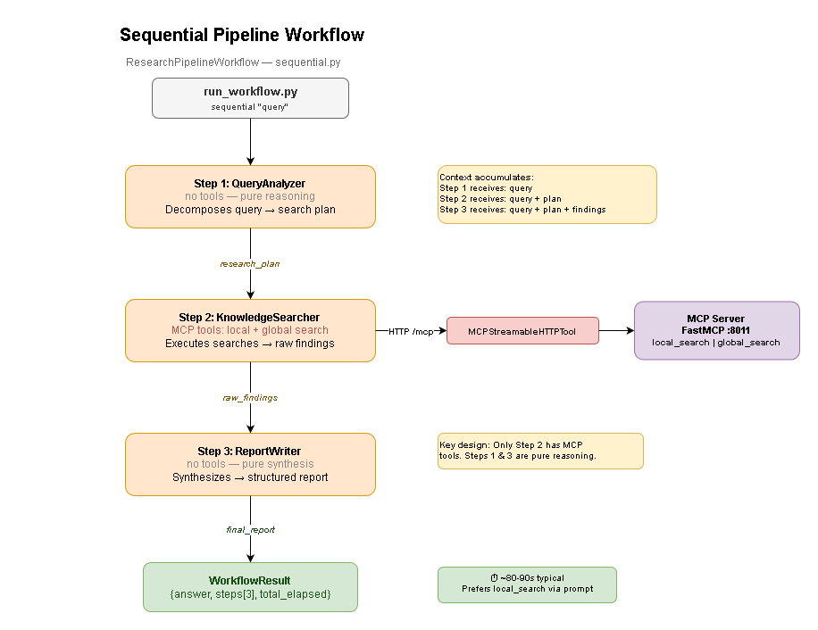
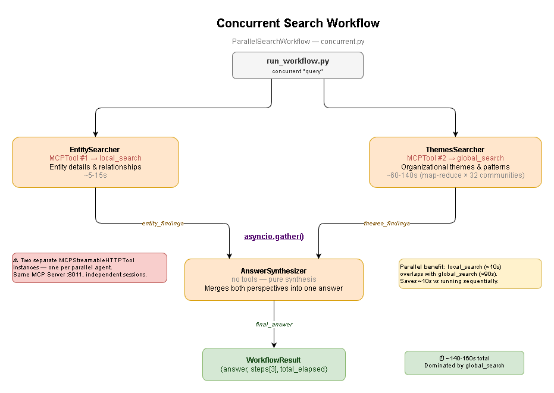
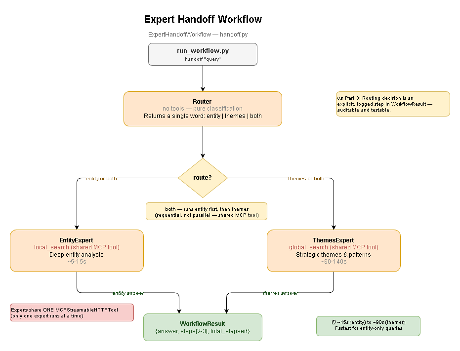

# Workflows Module — Part 4: Workflow Patterns

Multi-agent workflow patterns that extend the single-agent Knowledge Captain from Part 3.

## Architecture Overview

```
                         User Query
                              │
                ┌─────────────┼─────────────┐
                │             │             │
                ▼             ▼             ▼
         Sequential      Concurrent      Handoff
         Pipeline        Search          Router
                │             │             │
         Analyze         local + global   Router
         Search          (parallel)    classifies
         Write                │             │
                │         Synthesize   EntityExpert
                │             │         or
                ▼             ▼        ThemesExpert
             Result        Result        Result
```

## Workflow Patterns

### 1. Sequential Workflow (`sequential.py`) — Research Pipeline



**When to use**: Complex, multi-part questions that need structured decomposition before searching.

```
QueryAnalyzer → KnowledgeSearcher → ReportWriter
     │                │                  │
 Research plan    Raw findings    Final report
```

| Step | Agent             | Role                                |
| ---- | ----------------- | ----------------------------------- |
| 1    | QueryAnalyzer     | Decomposes query into a search plan |
| 2    | KnowledgeSearcher | Executes MCP searches from the plan |
| 3    | ReportWriter      | Synthesizes into structured report  |

**Best for**:

- "What are the leadership, technology decisions, and strategic goals of Project Alpha?"
- Complex research questions that span multiple domains

### 2. Concurrent Workflow (`concurrent.py`) — Parallel Search



**When to use**: Questions that benefit from both entity details AND organizational themes simultaneously.

Each parallel agent owns its own `MCPStreamableHTTPTool` with a `tool_name_prefix` (`entity`, `themes`) to avoid duplicate tool-name errors when both connect to the same MCP server.

```
                    Query
                   /     \
          EntitySearcher  ThemesSearcher    ← asyncio.gather()
          (prefix=entity)  (prefix=themes)
            (local_search)  (global_search)
                   \     /
               AnswerSynthesizer
```

| Step         | Agent             | Output                              |
| ------------ | ----------------- | ----------------------------------- |
| 1 (parallel) | EntitySearcher    | Entity details via local_search     |
| 2 (parallel) | ThemesSearcher    | Thematic patterns via global_search |
| 3            | AnswerSynthesizer | Merged comprehensive answer         |

**Best for**:

- "What are the main projects and who leads them?"
- Questions where entity-level and organizational-level perspectives complement each other

### 3. Handoff Workflow (`handoff.py`) — Expert Routing



**When to use**: When you want explicit, auditable routing to specialist agents.

```
Router (classifies) → EntityExpert  (entity questions)
                    → ThemesExpert  (themes questions)
                    → Both          (mixed questions)
```

| Route  | Agent        | Search type   | Example query                        |
| ------ | ------------ | ------------- | ------------------------------------ |
| entity | EntityExpert | local_search  | "Who leads Project Alpha?"           |
| themes | ThemesExpert | global_search | "What are the main initiatives?"     |
| both   | Both in turn | both          | "Describe the projects and strategy" |

**Best for**:

- Demonstrating how routing becomes an explicit, logged step
- Systems with many specialist agents
- When routing logic must be auditable

## Choosing the Right Workflow

| Workflow              | Speed       | Traceability | Best Query Type     | Why                                                |
| --------------------- | ----------- | ------------ | ------------------- | -------------------------------------------------- |
| Single Agent (Part 3) | Fastest     | Low          | Simple Q&A          | One agent, one search call                         |
| Sequential            | Medium      | Highest      | Complex multi-part  | Prefers local_search; only uses global when needed |
| Handoff               | Medium–Slow | High         | Specialist-specific | Router skips global_search for entity-only queries |
| Concurrent            | Slowest     | Medium       | Dual-perspective    | **Always** runs global_search (slow map-reduce)    |

> **Performance note**: `global_search` uses map-reduce over all community reports (~32 LLM calls).
> Any workflow that triggers `global_search` will take 60–140s depending on Azure OpenAI rate limits.
> `local_search` uses vector similarity + graph traversal with a single LLM call (~5–15s).
> Choose **sequential** or **handoff(entity)** for fastest results on entity-specific questions.

## Quick Start

```bash
# Prerequisites
poetry run python run_mcp_server.py   # Terminal 1

# Run workflow demo CLI
poetry run python run_workflow.py     # Terminal 2

# Or try a specific workflow
poetry run python run_workflow.py sequential "What are the key projects?"
poetry run python run_workflow.py concurrent "Who leads Project Alpha and what are the main themes?"
poetry run python run_workflow.py handoff    "What are the main strategic initiatives?"
```

## Programmatic Usage

```python
from workflows import ResearchPipelineWorkflow, ParallelSearchWorkflow, ExpertHandoffWorkflow

# Sequential
async with ResearchPipelineWorkflow() as wf:
    result = await wf.run("What is the technology strategy for Project Alpha?")
    print(result.answer)
    print(result.step_summary())   # Step-by-step trace

# Concurrent
async with ParallelSearchWorkflow() as wf:
    result = await wf.run("Who leads the projects and what are the key themes?")
    print(result.answer)

# Handoff
async with ExpertHandoffWorkflow() as wf:
    result = await wf.run("Who leads Project Alpha?")
    print(result.answer)
```

### Factory Functions (State Isolation)

Each call returns a fresh instance — agents and MCP connections are created on `__aenter__`, ensuring no state leaks between requests:

```python
from workflows import create_sequential_workflow, create_concurrent_workflow, create_handoff_workflow

# Each call returns a new, isolated workflow instance
workflow = create_sequential_workflow(mcp_url="http://localhost:8011/mcp")
async with workflow:
    result = await workflow.run("Analyze Project Alpha")

# Fresh instance — no shared state from the previous run
workflow2 = create_sequential_workflow()
async with workflow2:
    result2 = await workflow2.run("Analyze Project Beta")
```

| Factory Function               | Returns                    |
| ------------------------------ | -------------------------- |
| `create_sequential_workflow()` | `ResearchPipelineWorkflow` |
| `create_concurrent_workflow()` | `ParallelSearchWorkflow`   |
| `create_handoff_workflow()`    | `ExpertHandoffWorkflow`    |

## WorkflowResult

Every workflow returns a `WorkflowResult`:

```python
@dataclass
class WorkflowResult:
    answer: str                     # Final synthesized answer
    workflow_type: WorkflowType     # sequential | concurrent | handoff
    steps: list[WorkflowStep]       # All intermediate agent outputs
    total_elapsed_seconds: float    # Wall-clock time for entire workflow
    query: str                      # Original user query
```

Each `WorkflowStep` contains:

```python
@dataclass
class WorkflowStep:
    agent_name: str          # e.g. "QueryAnalyzer"
    input_summary: str       # Short description of the input
    output: str              # Agent's full output text
    elapsed_seconds: float   # Time for this step
    metadata: dict           # Optional extra info
```

## Live Output Examples

### Handoff: `poetry run python run_workflow.py handoff "Who leads Project Alpha?"`

```
Step 1: Router — classifying query...
Step 1: Router decided 'entity' (1.4s)
Step 2: EntityExpert — local search...
Step 2: EntityExpert completed (7.4s)

┏━━━━━━┳━━━━━━━━━━━━━━┳━━━━━━━━━━━━━━━━━━━━━━━━━━━━━━━━━━━━━━━━━━┳━━━━━━┓
┃ Step ┃ Agent        ┃ Action                                   ┃ Time ┃
┡━━━━━━╇━━━━━━━━━━━━━━╇━━━━━━━━━━━━━━━━━━━━━━━━━━━━━━━━━━━━━━━━━━╇━━━━━━┩
│ 1    │ Router       │ Classify: "Who leads Project Alpha?"     │ 1.4s │
│ 2    │ EntityExpert │ Entity-focused search for specific facts │ 7.4s │
└──────┴──────────────┴──────────────────────────────────────────┴──────┘
Total: 8.8s · 2 steps
```

### Sequential: `poetry run python run_workflow.py sequential "What are the key projects and their tech stack?"`

```
Step 1/3: QueryAnalyzer — decomposing query...     (1.9s)
Step 2/3: KnowledgeSearcher — executing MCP searches... (68.4s)
Step 3/3: ReportWriter — synthesizing report...     (13.3s)

┏━━━━━━┳━━━━━━━━━━━━━━━━━━━┳━━━━━━━━━━━━━━━━━━━━━━━━━━━━━━━━━━━━━━━━━━━━━━━━━━━━━━━━━━━━━━┳━━━━━━━┓
┃ Step ┃ Agent             ┃ Action                                                       ┃  Time ┃
┡━━━━━━╇━━━━━━━━━━━━━━━━━━━╇━━━━━━━━━━━━━━━━━━━━━━━━━━━━━━━━━━━━━━━━━━━━━━━━━━━━━━━━━━━━━━╇━━━━━━━┩
│ 1    │ QueryAnalyzer     │ Decompose: "What are the key projects and their tech stack?" │  1.9s │
│ 2    │ KnowledgeSearcher │ Execute MCP searches from research plan                      │ 68.4s │
│ 3    │ ReportWriter      │ Synthesize findings into structured report                   │ 13.3s │
└──────┴───────────────────┴──────────────────────────────────────────────────────────────┴───────┘
Total: 83.7s · 3 steps
```

### Concurrent: `poetry run python run_workflow.py concurrent "Who leads Project Alpha and what are the themes?"`

```
Steps 1+2: EntitySearcher + ThemesSearcher running in parallel... (103.9s)
Step 3: AnswerSynthesizer — merging perspectives...               (5.3s)

┏━━━━━━┳━━━━━━━━━━━━━━━━━━━┳━━━━━━━━━━━━━━━━━━━━━━━━━━━━━━━━━━━━━━━━━━━━━━━━━━━━━━━━━━━━━━━━━━━━━━━━━━━━━━┳━━━━━━━━┓
┃ Step ┃ Agent             ┃ Action                                                                       ┃   Time ┃
┡━━━━━━╇━━━━━━━━━━━━━━━━━━━╇━━━━━━━━━━━━━━━━━━━━━━━━━━━━━━━━━━━━━━━━━━━━━━━━━━━━━━━━━━━━━━━━━━━━━━━━━━━━━━╇━━━━━━━━┩
│ 1    │ EntitySearcher    │ Entity search: "Who leads Project Alpha and what are the themes?" (parallel) │ 103.9s │
│ 2    │ ThemesSearcher    │ Themes search: "Who leads Project Alpha and what are the themes?" (parallel) │ 103.9s │
│ 3    │ AnswerSynthesizer │ Merge entity details + thematic patterns                                     │   5.3s │
└──────┴───────────────────┴──────────────────────────────────────────────────────────────────────────────┴────────┘
Total: 109.2s · 3 steps
```

> **Timing insight**: Handoff (entity-only) completes in ~9s. Sequential takes ~84s. Concurrent takes ~109s due to `global_search` map-reduce over 32 communities.

## Module Structure

```
workflows/
├── __init__.py       # Public API exports
├── base.py           # WorkflowResult, WorkflowStep, WorkflowType, MCPWorkflowBase
├── sequential.py     # ResearchPipelineWorkflow (3-step chain)
├── concurrent.py     # ParallelSearchWorkflow (asyncio.gather + synthesis)
├── handoff.py        # ExpertHandoffWorkflow (Router → specialist)
└── README.md         # This file
```

## MCP Lifecycle Management

Different workflow patterns use different MCP tool ownership strategies:

| Pattern                  | MCP Ownership                                                                     | Why                                                                   |
| ------------------------ | --------------------------------------------------------------------------------- | --------------------------------------------------------------------- |
| **Sequential / Handoff** | Shared MCP tool, managed externally via `AsyncExitStack` in `MCPWorkflowBase`     | Multiple agents share one tool — the base class manages connect/close |
| **Concurrent**           | Each agent owns its own MCP tool via `Agent` context manager + `tool_name_prefix` | Parallel agents need separate connections to avoid conflicts          |

This follows Agent Framework rc5+ patterns: `Agent` as async context manager auto-manages MCP tool lifecycle. When a tool must be shared across agents, it’s managed externally to avoid premature disconnection.
